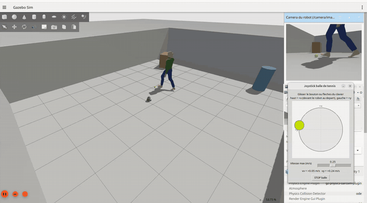

# Person Tracking avec TurtleBot3 sous ROS2

Un TurtleBot3 Burger détecte, identifie et suit une personne à ~1 m, en simulation (Gazebo) puis sur robot réel.
Chaîne : webcam → détection YOLO → tracker SORT codé from scratch → sélection de cible → asservissement visuel.



*Simulation Gazebo (×2) : la balle est déplacée au joystick à l'écran, le robot la suit. En haut à droite, l'image de la caméra du robot.*

> État : **Phase 1 (pipeline minimal) en simulation** : le robot suit une balle de tennis (détection couleur HSV, contrôleur P, watchdog). Test sur robot réel à venir.

## Packages

| Package | Type | Contenu |
|---|---|---|
| `tb_interfaces` | ament_cmake | Messages `Track`, `TrackArray`, `TargetState` |
| `tb_perception` | ament_python | `detector_node` (backends YOLO et couleur HSV) |
| `tb_tracking` | ament_python | `tracker_node`, `target_selector_node`, lib SORT sans dépendance ROS |
| `tb_control` | ament_python | `follower_controller`, watchdog |
| `tb_bringup` | ament_python | Launch files, `config/sim.yaml` / `real.yaml`, monde Gazebo, modèle `tb3_burger_cam` |

Architecture et topics : [docs/architecture.md](docs/architecture.md). Suivi du projet : [docs/rapport_avancement.md](docs/rapport_avancement.md).

## Prérequis

- Ubuntu 24.04, ROS2 Jazzy, Gazebo Harmonic (`ros-jazzy-ros-gz`)
- Paquets TurtleBot3 (`turtlebot3`, `turtlebot3_msgs`, `turtlebot3_simulations`, branche `jazzy`) dans le même workspace
- `ros-jazzy-vision-msgs`, `ros-jazzy-cv-bridge`
- Connexion internet au premier lancement (le modèle de la personne est téléchargé depuis Gazebo Fuel)

## Installation

```bash
cd ~/turtlebot3_ws/src
git clone <url-du-repo> person_tracking
cd ~/turtlebot3_ws
rosdep install --from-paths src --ignore-src -y
colcon build --symlink-install
source install/setup.bash
```

## Lancement

```bash
# Simulation : monde person_world + Burger avec webcam
ros2 launch tb_bringup bringup.launch.py mode:=sim
# sans fenêtre Gazebo
ros2 launch tb_bringup bringup.launch.py mode:=sim gui:=false

# Image de la caméra
ros2 run rqt_image_view rqt_image_view /camera/image_raw
```

`mode:=real` : sur le robot, lancer `turtlebot3_bringup` et le driver de la webcam, avec le même `ROS_DOMAIN_ID` que le laptop.

`bringup.launch.py` lance aussi la chaîne `detector_node` → `target_selector_node` → `follower_controller` (désactivable avec `pipeline:=false`). Les paramètres de chaque node sont dans `tb_bringup/config/sim.yaml` et `real.yaml`.

## Phase 1 : suivre une balle de tennis

```bash
ros2 launch tb_bringup bringup.launch.py mode:=sim
```

Le robot se tourne vers la balle de tennis (jaune-vert, 6,7 cm) et s'arrête à 1 m.

**Déplacer la balle avec le joystick à l'écran** (souris ou flèches du clavier) :

```bash
ros2 launch tb_bringup bringup.launch.py mode:=sim joystick:=true
# ou, simulation déjà lancée :
ros2 run tb_bringup ball_joystick
```

Le joystick publie `geometry_msgs/Twist` sur `/ball/cmd_vel` ; le plugin `VelocityControl` de la balle applique cette vitesse dans Gazebo. Haut = +x (devant le robot au départ), gauche = +y. Avec une vraie manette : `ros2 run joy joy_node` + `ros2 run teleop_twist_joy teleop_node --ros-args -r cmd_vel:=ball/cmd_vel`.

Autre possibilité : placer la balle à une position précise en ligne de commande :

```bash
gz service -s /world/person_world/set_pose --reqtype gz.msgs.Pose --reptype gz.msgs.Boolean \
  --timeout 2000 --req 'name: "tennis_ball", position: {x: 2.25, y: 1.3, z: 0.0335}'
```

Images de debug : `ros2 run rqt_image_view rqt_image_view /detector/debug_image`.

**Arrêt d'urgence (SEC-05)**, dans un autre terminal :

```bash
ros2 run tb_control estop_keyboard   # g = activer le suivi, espace = arrêt, q = quitter
```

En simulation le suivi démarre actif. En réel (`real.yaml`), il démarre **désactivé** : il faut appuyer sur `g`.

| Sécurité | Réglage |
|---|---|
| SEC-01 watchdog | arrêt si plus de cible depuis 0,3 s |
| SEC-02 saturation | 0,15 m/s, 1,0 rad/s |
| SEC-03 accélération | 0,3 m/s², 2,0 rad/s² |
| SEC-04 distance minimale | pas d'avance sous 0,5 m ; le robot ne recule jamais |
| SEC-05 arrêt d'urgence | `estop_keyboard` |

## Tests

```bash
cd ~/turtlebot3_ws/src/person_tracking
for p in tb_perception tb_tracking tb_control; do (cd $p && python3 -m pytest -q test); done
```

## Simulation

- **Robot** : `tb3_burger_cam`, dérivé de `turtlebot3_burger_cam` (ROBOTIS). La caméra fisheye 182° d'origine est remplacée par une caméra standard proche d'une webcam USB : 640×480, FOV horizontal 70°, 30 Hz, bruit gaussien. Frame : `camera_rgb_optical_frame`.
- **Monde** : `person_world.sdf`, pièce 10 × 8 m, deux obstacles, une personne (actor) qui marche en boucle sur un rectangle à 2.5–3.5 m devant le robot.

| Topic | Type | Source |
|---|---|---|
| `/camera/image_raw` | `sensor_msgs/Image` | caméra (30 Hz) |
| `/camera/camera_info` | `sensor_msgs/CameraInfo` | caméra |
| `/scan` | `sensor_msgs/LaserScan` | LiDAR (5 Hz) |
| `/odom`, `/tf`, `/joint_states`, `/imu` | | diff drive, IMU |
| `/cmd_vel` | `geometry_msgs/TwistStamped` | commande (subscriber) |

Monde : une balle de tennis statique (`tennis_ball`, 6,7 cm, jaune-vert) est posée en (2.0, 0.6) pour la Phase 1.

La fenêtre Gazebo utilise `tb_bringup/config/gz_gui.config` : l'image de la caméra et les rayons du LiDAR (`/scan`) sont affichés d'office dans le panneau de droite.
