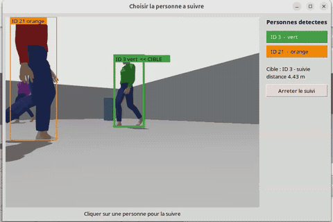

# Person Tracking avec TurtleBot3 sous ROS2

Un TurtleBot3 Burger détecte, identifie et suit une personne à ~1 m, en simulation (Gazebo) puis sur robot réel.
Chaîne : webcam → détection YOLO26n → suivi multi-personnes ByteTrack (un ID et une couleur de vêtements par personne) → choix de la personne par l'utilisateur → angle (caméra) et distance (LiDAR) → asservissement visuel.



*Simulation Gazebo (×2), fenêtre de choix : la cible est la personne verte (ID 3) ; la rouge passe devant la caméra, la violette croise la cible ; l'ID 3 reste la cible.*

> État : **en simulation**, le robot détecte les personnes, leur donne un ID et une couleur de vêtements ; l'utilisateur clique sur celle à suivre ; la cible est retrouvée par sa couleur si elle revient sous un autre ID. Le robot suit aussi une balle de tennis (`target:=ball`, Phase 1). Test sur robot réel à venir.

## Packages

| Package | Type | Contenu |
|---|---|---|
| `tb_interfaces` | ament_cmake | Messages `Track`, `TrackArray`, `TargetState` |
| `tb_perception` | ament_python | `detector_node` : YOLO26n + ByteTrack (Ultralytics) ou couleur HSV ; couleur des vêtements par ID |
| `tb_tracking` | ament_python | `target_selector_node` ; libs sans ROS : verrouillage et ré-identification (`target_lock.py`), géométrie (`target_geometry.py`) |
| `tb_control` | ament_python | `follower_controller` (contrôleur P, watchdog, limites), `estop_keyboard` |
| `tb_bringup` | ament_python | Launch files, configs, monde Gazebo, modèle `tb3_burger_cam`, fenêtre `target_chooser`, joystick de la balle |

Architecture et topics : [docs/architecture.md](docs/architecture.md). Suivi du projet : [docs/rapport_avancement.md](docs/rapport_avancement.md).

## Prérequis

- Ubuntu 24.04, ROS2 Jazzy, Gazebo Harmonic (`ros-jazzy-ros-gz`)
- Paquets TurtleBot3 (`DynamixelSDK`, `turtlebot3`, `turtlebot3_msgs`, `turtlebot3_simulations`, **branche `jazzy`**) dans le même workspace
- `ros-jazzy-vision-msgs`, `ros-jazzy-cv-bridge`, `python3-pil.imagetk` (fenêtre de choix)
- Pour les personnes (YOLO) : PyTorch CPU et Ultralytics dans `~/.local`, sans casser le NumPy de ROS :
  ```bash
  pip install --user --break-system-packages torch torchvision --index-url https://download.pytorch.org/whl/cpu
  pip install --user --break-system-packages --no-deps ultralytics ultralytics-thop
  pip install --user --break-system-packages numpy==1.26.4 lap
  ```
  Le modèle `yolo26n.pt` est téléchargé au premier lancement dans `~/.cache/person_tracking`.
- Connexion internet au premier lancement (le modèle de la personne est téléchargé depuis Gazebo Fuel)

## Installation

```bash
cd ~/turtlebot3_ws/src
git clone <url-du-repo> person_tracking
cd ~/turtlebot3_ws
rosdep install --from-paths src --ignore-src -y
colcon build --symlink-install
source install/setup.bash
```

## Lancement

```bash
# Simulation : monde person_world + Burger avec webcam
ros2 launch tb_bringup bringup.launch.py mode:=sim
# sans fenêtre Gazebo
ros2 launch tb_bringup bringup.launch.py mode:=sim gui:=false

# Image de la caméra
ros2 run rqt_image_view rqt_image_view /camera/image_raw
```

`mode:=real` : voir la section [Robot réel](#robot-réel).

`bringup.launch.py` lance aussi la chaîne `detector_node` → `target_selector_node` → `follower_controller` (désactivable avec `pipeline:=false`). Les paramètres communs sont dans `tb_bringup/config/sim.yaml` et `real.yaml`, ceux de la cible dans `target_person.yaml` ou `target_ball.yaml` (argument `target:=`).

## Suivre une personne choisie

```bash
ros2 launch tb_bringup bringup.launch.py mode:=sim            # target:=person par défaut
```

Une fenêtre **« Choisir la personne a suivre »** s'ouvre : chaque personne détectée y apparaît avec son ID et la couleur de ses vêtements. **Cliquer sur une personne** (ou sur son bouton) pour que le robot la suive ; « Arreter le suivi » pour arrêter. Tant que personne n'est choisi, le robot ne bouge pas.

- Sans la fenêtre : `chooser:=false`, puis `ros2 topic pub --once /target/select std_msgs/msg/Int32 "{data: 3}"` (−1 = arrêter).
- Si la cible est cachée et revient avec un autre ID, elle est retrouvée par la couleur de ses vêtements (log `Cible re-identifiee par ses vetements`).
- Distance : LiDAR jusqu'à 3,5 m ; au-delà, hauteur de la silhouette.
- Monde : pièce de 18 × 14 m, trois personnes (pulls rouge, vert, violet) qui marchent entre 4 et 12 m du robot.

## Phase 1 : suivre une balle de tennis

```bash
ros2 launch tb_bringup bringup.launch.py mode:=sim target:=ball
```

Le robot se tourne vers la balle de tennis (jaune-vert, 6,7 cm) et s'arrête à 1 m.

**Déplacer la balle avec le joystick à l'écran** (souris ou flèches du clavier) :

```bash
ros2 launch tb_bringup bringup.launch.py mode:=sim target:=ball joystick:=true
# ou, simulation déjà lancée :
ros2 run tb_bringup ball_joystick
```

Le joystick publie `geometry_msgs/Twist` sur `/ball/cmd_vel` ; le plugin `VelocityControl` de la balle applique cette vitesse dans Gazebo. Haut = +x (devant le robot au départ), gauche = +y. Avec une vraie manette : `ros2 run joy joy_node` + `ros2 run teleop_twist_joy teleop_node --ros-args -r cmd_vel:=ball/cmd_vel`.

Autre possibilité : placer la balle à une position précise en ligne de commande :

```bash
gz service -s /world/person_world/set_pose --reqtype gz.msgs.Pose --reptype gz.msgs.Boolean \
  --timeout 2000 --req 'name: "tennis_ball", position: {x: 2.25, y: 1.3, z: 0.0335}'
```

Images de debug : `ros2 run rqt_image_view rqt_image_view /detector/debug_image`.

**Arrêt d'urgence (SEC-05)**, dans un autre terminal :

```bash
ros2 run tb_control estop_keyboard   # g = activer le suivi, espace = arrêt, q = quitter
```

En simulation le suivi démarre actif. En réel (`real.yaml`), il démarre **désactivé** : il faut appuyer sur `g`.

| Sécurité | Réglage |
|---|---|
| SEC-01 watchdog | arrêt si plus de cible depuis 0,3 s |
| SEC-02 saturation | 0,15 m/s, 1,0 rad/s |
| SEC-03 accélération | 0,3 m/s², 2,0 rad/s² |
| SEC-04 distance minimale | pas d'avance sous 0,5 m ; recul désactivé par défaut (`max_reverse: 0.0`, ex. 0.05 pour l'autoriser) |
| SEC-05 arrêt d'urgence | `estop_keyboard` |

## Régler les seuils de couleur

```bash
ros2 run tb_perception hsv_tuner                       # simulation
ros2 run tb_perception hsv_tuner --ros-args -p image_topic:=/image_raw -p image_transport:=compressed   # robot réel
```

Fenêtre avec l'image, le masque et des curseurs H/S/V. Touche `s` : affiche la ligne `hsv_ranges` à copier dans `config/sim.yaml` ou `config/real.yaml`. Touche `q` : quitter.

## Enregistrer et rejouer (rosbags)

```bash
ros2 launch tb_bringup bringup.launch.py mode:=sim record:=true     # -> ~/rosbags/sim_<date>/
ros2 bag info ~/rosbags/sim_<date>
```

Sont enregistrés : l'image compressée, `camera_info`, `/scan`, `/odom`, `/tf`, `/detections`, `/tracks`, `/target`, `/target/select`, `/cmd_vel`, `/follower/enable`. Environ 0,7 Mo/s. Les rosbags sont exclus du dépôt git.

Rejouer les images pour tester un détecteur sans robot ni simulation :

```bash
ros2 run tb_perception detector_node --ros-args -p image_transport:=compressed -p use_sim_time:=true \
  -r detections:=/replay/detections
ros2 bag play ~/rosbags/sim_<date> --clock --topics /camera/image_raw/compressed /camera/camera_info
```

## Robot réel

**Sur le Raspberry Pi du robot** (Ubuntu 24.04 + ROS 2 Jazzy, installés selon le e-Manual ROBOTIS) :

```bash
sudo apt install ros-jazzy-usb-cam chrony
# workspace du robot : turtlebot3 (branche jazzy) + ce dépôt
cd ~/turtlebot3_ws/src && git clone https://github.com/amineherch-robotics/person_tracking.git
cd ~/turtlebot3_ws && colcon build --symlink-install --packages-select tb_bringup
echo 'export ROS_DOMAIN_ID=30' >> ~/.bashrc     # même valeur sur le laptop
export TURTLEBOT3_MODEL=burger LDS_MODEL=LDS-02  # LDS-01, LDS-02 ou LDS-03 : modèle du LiDAR (étiquette sur le capteur)
ros2 launch turtlebot3_bringup robot.launch.py   # moteurs, /odom, /scan
ros2 launch tb_bringup robot_camera.launch.py    # webcam -> /image_raw/compressed (config/usb_cam.yaml)
```

**Sur le laptop** (même `ROS_DOMAIN_ID`) :

```bash
ros2 topic hz /image_raw/compressed                          # vérifier que les images arrivent (~15 Hz)
ros2 run tb_perception hsv_tuner --ros-args -p image_topic:=/image_raw -p image_transport:=compressed
ros2 launch tb_bringup bringup.launch.py mode:=real record:=true
ros2 run tb_control estop_keyboard                           # g = démarrer le suivi, espace = arrêt
```

En réel, le suivi démarre **désactivé** : il faut appuyer sur `g`. Avant le premier essai : zone dégagée, une personne qui surveille le robot (SEC-06), et test du watchdog en coupant le WiFi.

Pour que la latence affichée soit juste, les horloges du robot et du laptop doivent être synchronisées (`chrony`, `chronyc tracking`).

## Tests

```bash
cd ~/turtlebot3_ws/src/person_tracking
for p in tb_perception tb_tracking tb_control tb_bringup; do (cd $p && python3 -m pytest -q test); done   # 42 tests
```

## Rapport

Le suivi du projet est dans [docs/rapport_avancement.md](docs/rapport_avancement.md). Pour en faire un PDF (non versionné) :

```bash
sudo apt install python3-markdown      # une seule fois
python3 docs/build_pdf.py              # -> docs/rapport_avancement.pdf (Chrome ou Chromium requis)
```

## Simulation

- **Robot** : `tb3_burger_cam`, dérivé de `turtlebot3_burger_cam` (ROBOTIS). La caméra fisheye 182° d'origine est remplacée par une caméra standard proche d'une webcam USB : 640×480, FOV horizontal 70°, 30 Hz, bruit gaussien. Elle est montée **en haut du robot** (26 cm du sol, au-dessus du LiDAR, sur un mât). Frame : `camera_rgb_optical_frame`.
- **Monde** : `person_world.sdf`, pièce 18 × 14 m, deux obstacles, trois personnes (actors, pulls rouge / vert / violet, modèle Gazebo Fuel `Mingfei/actor`, CC BY 4.0) qui marchent en boucle entre 4 et 12 m du robot.

| Topic | Type | Source |
|---|---|---|
| `/camera/image_raw` | `sensor_msgs/Image` | caméra (30 Hz) |
| `/camera/camera_info` | `sensor_msgs/CameraInfo` | caméra |
| `/scan` | `sensor_msgs/LaserScan` | LiDAR (5 Hz) |
| `/odom`, `/tf`, `/joint_states`, `/imu` | | diff drive, IMU |
| `/cmd_vel` | `geometry_msgs/TwistStamped` | commande (subscriber) |

Monde : une balle de tennis (`tennis_ball`, 6,7 cm, jaune-vert) est posée en (2.0, 0.6) pour la Phase 1 ; elle se déplace au joystick.

Vidéos de démonstration (hors dépôt) : suivi de la balle au joystick (Phase 1), choix d'une personne et ré-identification, passages devant la cible.

La fenêtre Gazebo utilise `tb_bringup/config/gz_gui.config` : l'image de la caméra et les rayons du LiDAR (`/scan`) sont affichés d'office dans le panneau de droite.
