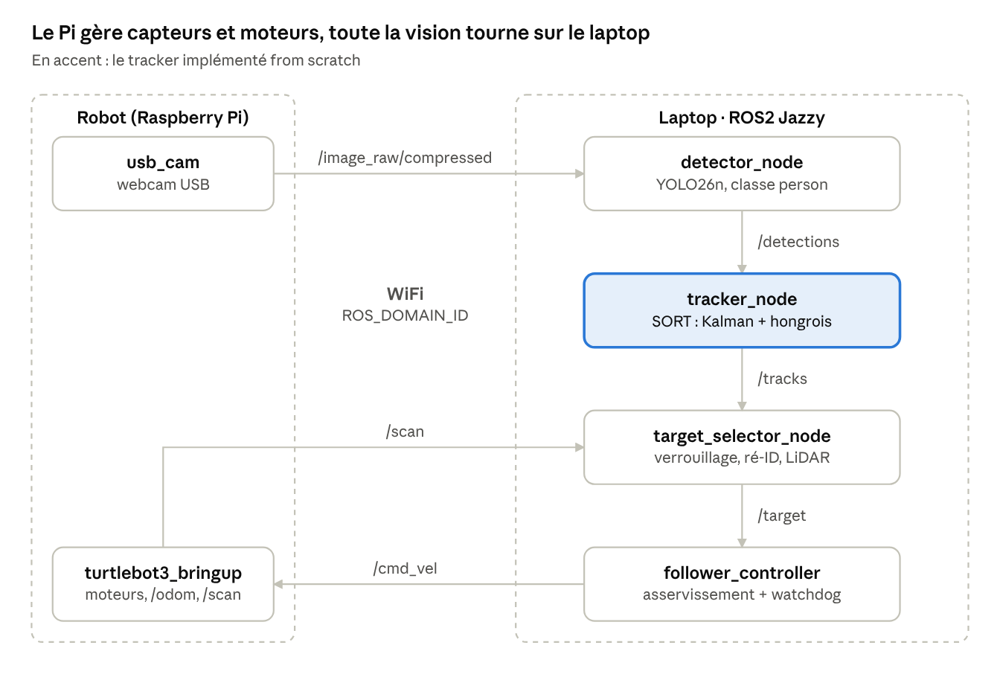
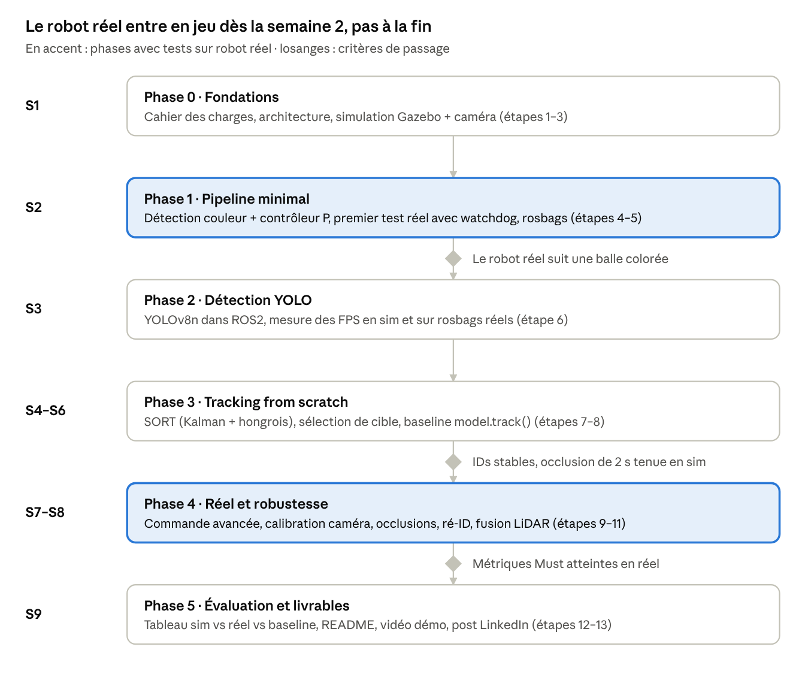
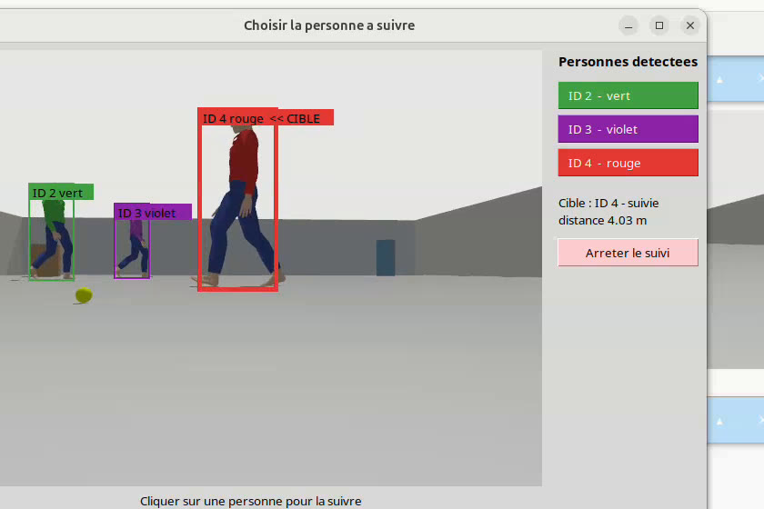
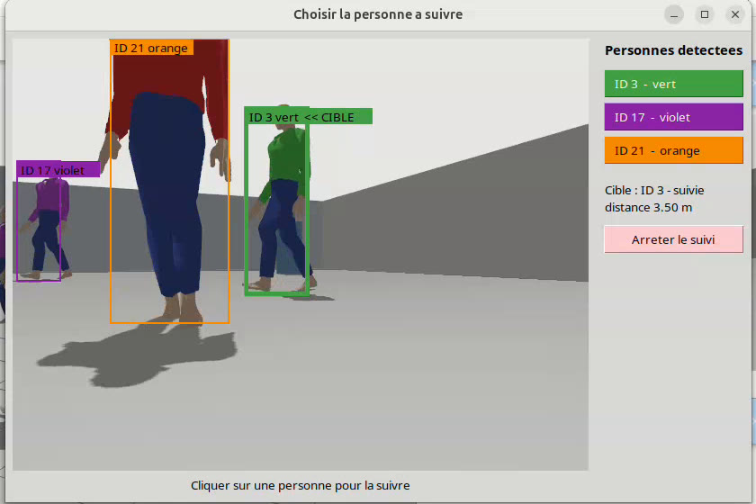
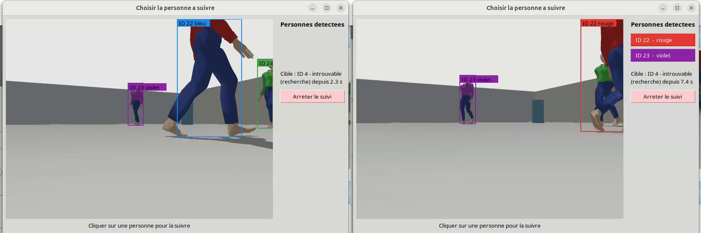
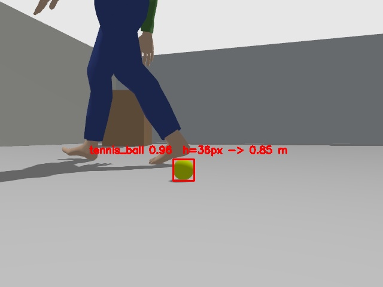
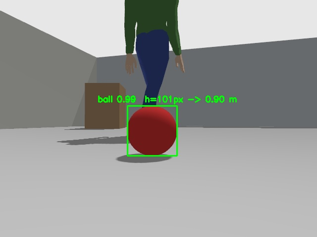
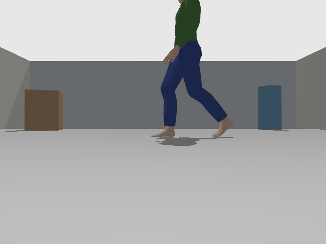

# Rapport d'avancement — Person Tracking avec TurtleBot3 sous ROS2

Document mis à jour à chaque avancement. Les entrées du journal sont ajoutées en haut de la section 3, de la plus récente à la plus ancienne.

Pour comprendre comment fonctionne ce qui a été construit : **annexes pédagogiques** en fin de document (A : la chaîne pas à pas, B : la méthode de travail, C : le glossaire, D : les nodes et les topics, E : refaire le projet seul, étape par étape).

Sections : 1. Présentation et plan · 2. État d'avancement · 3. Journal · 4. Problèmes et solutions · 5. Points ouverts · 6. Prochaines étapes · Annexes A à E.

**Dernière mise à jour :** 6 octobre 2026 (soir) · **Phase en cours :** en simulation, le robot détecte les personnes (YOLO), leur donne un ID et une couleur de vêtements, l'utilisateur choisit qui suivre, et la cible est retrouvée après une occlusion ; test réel de la Phase 1 en attente

## 1. Présentation du projet et plan suivi

### 1.1 Le projet en bref

**Objectif.** Un robot mobile TurtleBot3 Burger repère une personne avec une caméra, la suit en temps réel et reste à environ 1 m d'elle. Le projet est d'abord développé en simulation (Gazebo), puis testé sur le vrai robot.

**Pourquoi ce projet.** Mes expériences précédentes couvraient la navigation autonome, le SLAM et la gestion de flotte de robots (MiR, Open-RMF), mais pas la vision par ordinateur. Le suivi de personne réunit tout ce qui manquait : la détection d'objets par deep learning, le suivi de plusieurs objets dans le temps, l'estimation d'état et la commande en boucle fermée. C'est aussi un vrai besoin industriel : robots suiveurs, chariots autonomes. Le projet sert à apprendre et à le montrer (dépôt GitHub, vidéo, résultats chiffrés).

**Le principe en une phrase.** Pour chaque image, on trouve les personnes (détection), on garde le même identifiant pour chacune d'une image à l'autre (tracking), on choisit celle à suivre (sélection de cible), on calcule son angle et sa distance, et on en déduit la vitesse des roues (commande).

**Les outils.**

| Élément | Choix |
|---|---|
| Robot | TurtleBot3 Burger (Raspberry Pi, LiDAR 360°) + webcam USB |
| Logiciel | ROS 2 Jazzy, Python, OpenCV |
| Simulation | Gazebo Harmonic |
| Détection | Couleur (HSV) en Phase 1, puis YOLO26n (réseau de neurones) en Phase 2 |
| Tracking | Prévu : SORT codé soi-même. Réalisé : ByteTrack (Ultralytics) + verrouillage d'un ID + ré-identification par la couleur des vêtements |
| Choix de la cible | Fenêtre `target_chooser` : l'utilisateur clique sur la personne à suivre |
| Commande | Contrôleur P, puis PI, avec limites de sécurité |

### 1.2 L'architecture



*Schéma du cahier des charges. Le Raspberry Pi du robot gère seulement les capteurs et les moteurs. Toute la vision et la commande tournent sur le laptop, relié en WiFi. En simulation, Gazebo remplace le robot et publie les mêmes topics.*

Le code est découpé en 5 packages ROS 2 : `tb_interfaces` (messages), `tb_perception` (voir), `tb_tracking` (suivre et choisir la cible), `tb_control` (commander en sécurité), `tb_bringup` (tout lancer). Le détail de chaque package est à l'annexe E, étape 3 ; les nodes et topics à l'annexe D.

### 1.3 Le plan de travail

Le cahier des charges découpe le projet en 6 phases sur environ 9 semaines. Deux règles guident ce plan :

- **Le robot réel arrive tôt** (semaine 2), pas à la fin. Les problèmes du monde réel (éclairage, WiFi, latence) apparaissent ainsi avant d'avoir construit toute la chaîne.
- **On ne passe à la phase suivante qu'une fois son critère de passage validé** (losanges du schéma).



*Planning du cahier des charges. En bleu, les phases avec tests sur le robot réel. Note : le schéma indique « YOLOv8n » en Phase 2, alors que le texte du cahier des charges retient YOLO26n (point ouvert n° 2).*

| Phase | Ce qu'on construit | Pourquoi à ce moment | Critère de passage |
|---|---|---|---|
| 0 · Fondations | Cahier des charges, architecture, simulation avec caméra | Savoir quoi construire et avoir un terrain d'essai | — |
| 1 · Pipeline minimal | Détection couleur, contrôleur P, sécurité, premier test réel | Valider toute la chaîne avec le détecteur le plus simple, pour isoler les problèmes de commande, de réseau et de sécurité | Le robot réel suit une balle |
| 2 · Détection YOLO | Détection de personnes par réseau de neurones | Remplacer seulement le détecteur, une fois le reste validé | — |
| 3 · Tracking from scratch | SORT (Kalman + hongrois), verrouillage d'une cible, comparaison avec le tracker d'Ultralytics | Le cœur de l'apprentissage : garder le même identifiant malgré les occlusions | IDs stables, occlusion de 2 s tenue en simulation |
| 4 · Réel et robustesse | Contrôleur PI, calibration, ré-identification, fusion LiDAR | Corriger ce que le réel révèle | Métriques « Must » atteintes en réel |
| 5 · Évaluation et livrables | Tableau de résultats, README, vidéo, post LinkedIn | Montrer le travail | — |

### 1.4 Le plan suivi jusqu'ici

| Phase | Réalisé | Écarts par rapport au plan |
|---|---|---|
| Préparation | Workspace TurtleBot3 réparé (ancienne compilation Humble), simulation et LiDAR vérifiés | Non prévu : il a fallu d'abord remettre l'environnement en état |
| 0 · Fondations | ✅ Cahier des charges corrigé, 5 packages, messages, robot avec webcam, monde avec personne, lancement `mode:=sim/real` | Le modèle `burger_cam` existait déjà chez ROBOTIS : il a été adapté (caméra standard au lieu du fisheye) au lieu d'être créé |
| 1 · Pipeline minimal | ⏳ Simulation validée : détection, sélection, contrôleur P, watchdog, arrêt d'urgence, 16 tests ; balle pilotable au joystick | Balle de tennis au lieu d'une balle rouge (plus facile à trouver pour le test réel) ; joystick ajouté pour tester une cible mobile ; **test réel et rosbags pas encore faits** |
| 2 · Détection YOLO | ✅ en simulation | Le projet est réorganisé en **deux parties** : (1) détection des personnes avec YOLO, (2) suivi multi-objets avec le tracker intégré d'Ultralytics. La distance vient du LiDAR, la personne étant coupée par le haut de l'image |
| 3 · Tracking | ⏳ Suivi ByteTrack, couleur des vêtements par ID, choix de la personne par l'utilisateur, ré-identification après occlusion, en simulation | **Écart au cahier des charges** : le suivi utilise ByteTrack (Ultralytics) au lieu d'un SORT codé soi-même. SORT reste possible plus tard, pour comparer. **Ajouté** (demande en cours de projet) : l'utilisateur choisit la personne au lieu d'une sélection automatique ; la ré-identification (prévue en Phase 4) est avancée, en version simple (couleur) |
| 4 et 5 | ⬜ | — |

**Décision prise** : la caméra est montée **en haut du robot** (26 cm du sol, au-dessus du LiDAR, sur un mât). **Décisions en attente** : autoriser un léger recul (devenu important : une personne qui avance vers le robot finit trop près, voir section 5).

## 2. État d'avancement

| Phase | Semaines | Contenu | État |
|---|---|---|---|
| 0 · Fondations | S1 | Cahier des charges, architecture, simulation Gazebo + caméra | ✅ Terminée |
| 1 · Pipeline minimal | S2 | Détection couleur, contrôleur P, watchdog, premier test réel, rosbags | ⏳ Simulation validée ; outils du réel prêts (webcam, réglage HSV, rosbags) ; test réel à faire |
| 2 · Détection YOLO | S3 | YOLO dans ROS2, mesure des FPS en sim et sur rosbags | ✅ En simulation (YOLO26n, 11 images/s avec le suivi) |
| 3 · Tracking | S4–S6 | Suivi multi-objets, sélection et verrouillage de la cible | ⏳ En simulation : ByteTrack, couleur des vêtements par ID, choix de la personne à la souris, ré-identification par la couleur ; SORT codé soi-même non fait |
| 4 · Réel et robustesse | S7–S8 | Commande avancée, calibration, occlusions, ré-ID, fusion LiDAR | ⬜ |
| 5 · Évaluation et livrables | S9 | Tableau sim / réel / baseline, README, vidéo, post LinkedIn | ⬜ |

### Exigences

| ID | Exigence | Priorité | État |
|---|---|---|---|
| EF-01 | Flux webcam publié dans ROS2 | Must | 🟡 En simulation (`/camera/image_raw`) ; réel à faire |
| EF-02 | Détection des personnes (bbox + score) | Must | ✅ YOLO26n, en simulation |
| EF-03 | Identifiant stable par personne | Must | 🟡 Vidéo 2 : la cible garde le même ID pendant 5 min 37 s, malgré les passages des autres personnes. Mais une personne très proche (jambes seules) reçoit plusieurs IDs |
| EF-04 | Track maintenu pendant une occlusion ≤ 2 s | Must | 🟡 ByteTrack garde une piste cachée 90 images (≈ 9 s à 10 images/s) ; vidéo 2 : ID gardé quand une personne passe devant la caméra ; pas encore de mesure chiffrée sur une occlusion scriptée |
| EF-05 | Sélection et verrouillage d'une cible | Must | ✅ L'utilisateur choisit l'ID dans la fenêtre `target_chooser` (ou mode automatique : la plus proche du centre) ; l'ID est gardé même si une autre personne passe au centre |
| EF-06 | Orientation vers la cible, distance de 1 m | Must | 🟡 Validé en sim sur une balle de tennis (1,00 m) ; personne et réel à faire |
| EF-07 | Mode recherche si cible perdue > 2 s | Should | 🟡 État SEARCHING publié après 2 s ; rotation pas encore implémentée |
| EF-08 | Ré-identification après occlusion longue | Should | 🟡 Par la couleur des vêtements : vidéo 1, cible retrouvée sous un nouvel ID (4 → 29) ; limite : deux personnes de même couleur |
| EF-09 | Distance par fusion caméra-LiDAR | Should | 🟡 Rayons du LiDAR dans la direction de la personne ; erreur ≈ +11 cm |
| EF-10 | Image de debug (bbox, IDs, cible) | Must | ✅ `/detector/debug_image` (bbox + ID) et fenêtre `target_chooser` (ID, couleur, « << CIBLE », état et distance) |
| EF-11 | Même code en sim et en réel (`mode:=sim/real`) | Must | 🟡 Chaîne complète lancée par `mode:=sim/real` ; réel pas encore testé |
| EF-12 | Backend de détection couleur (HSV) | Could | ✅ `detector_node backend:=color` |
| ENF-01 | `header.stamp` d'origine conservé | — | ✅ Recopié jusqu'au contrôleur, latence mesurée |
| ENF-02 | Paramètres en YAML | — | ✅ Topics, seuils HSV, gains et limites dans `sim.yaml` / `real.yaml` |
| ENF-03 | Lib indépendante de ROS, testée avec pytest | — | 🟡 42 tests (perception 10, tracking 21, commande 9, bringup 2) ; lib SORT non faite |
| ENF-05 | Séquences enregistrées en rosbag et rejouables | — | 🟡 `record:=true` (avec `/tracks` et `/target/select`) et rejeu validés en simulation ; rosbags réels à faire |
| ENF-06 | README reproductible en < 15 min | — | 🟡 Simulation, rosbags et robot réel documentés |
| SEC-01 | Watchdog | — | ✅ Arrêt en 275 ms après coupure de la caméra |
| SEC-02 à 04 | Saturation, accélération, distance minimale | — | ✅ Implémenté et testé (pytest) |
| SEC-05 | Arrêt d'urgence clavier | — | 🟡 `estop_keyboard` ; priorité de la téléop pas encore gérée |
| SEC-06 | Zone dégagée et surveillance | — | ⬜ Lors du test réel |

Légende : ✅ fait · 🟡 partiel · ⏳ en cours · ⬜ pas commencé

## 3. Journal

### 6 octobre 2026 (soir) — Choisir la personne à suivre, et la retrouver après une occlusion

**La demande.** (1) Le robot détecte les personnes et donne à chacune une couleur de vêtements ; l'utilisateur voit les IDs et **choisit** qui suivre. (2) Un monde plus grand, avec les personnes plus loin. (3) Quand une autre personne passe devant la cible, le robot ne doit pas la perdre. (4) La caméra montée en haut du robot.

**Ce qui a été fait**

| Changement | Fichier(s) | En bref |
|---|---|---|
| Couleur des vêtements par ID | `tb_perception/clothing_color.py`, `detector_node.py`, `Track.msg` | Couleur dominante du tronc, votée sur les 15 dernières images de chaque ID, publiée dans le nouveau champ `color` de `Track` |
| Pulls de couleurs différentes | `tb_bringup/actor_skins.py`, `person_world.sdf` | Trois copies du modèle 3D de la personne : pull rouge, vert, violet |
| Fenêtre de choix | `tb_bringup/target_chooser.py` | Image de la caméra avec « ID n couleur » ; un clic publie l'ID sur `/target/select` |
| Sélection manuelle | `target_lock.py`, `target_selector_node.py`, `target_person.yaml` | `selection: manual` : le robot attend un choix, puis garde cet ID |
| Monde agrandi | `person_world.sdf`, `gz_gui.config` | Pièce de 18 × 14 m ; personnes entre 4 et 12 m du départ du robot |
| Distance au-delà du LiDAR | `target_selector_node.py` | Au-delà de 3,5 m (portée du LiDAR) : distance par la hauteur de la silhouette (1,75 m), si elle est vue en entier |
| Ré-identification par la couleur | `target_lock.py` | La cible revient sous un nouvel ID : on la retrouve par la couleur de son pull |
| Pistes gardées plus longtemps | `config/bytetrack_person.yaml` | `track_buffer` 30 → 90 images |
| Caméra en haut | `model.sdf`, `tb3_burger_cam.urdf` | 13 cm → 26 cm du sol, au-dessus du LiDAR, sur un mât |

**1. La couleur des vêtements.** Pour chaque personne détectée, `clothing_color()` regarde le **tronc** : la moitié centrale de la bbox en largeur, de 15 % à 45 % de sa hauteur (sous la tête, au-dessus des jambes). Elle passe ces pixels en HSV, garde ceux qui sont vraiment colorés (saturation ≥ 70, luminosité ≥ 50), et donne le nom de la teinte la plus fréquente (rouge, orange, jaune, vert, bleu, violet). S'il y a trop peu de pixels colorés, la réponse est blanc, gris ou noir. Une seule image peut se tromper (bras, ombre) : le node garde les 15 dernières réponses de chaque ID et publie la plus fréquente (**vote majoritaire**). Premier essai : la personne verte était annoncée « bleu ». Cause : de près, sa tête sort de l'image, donc la bande 15–45 % tombait sur le jean. Correction : on ne vote avec cette bande que si le haut de la bbox est visible ; sinon, en repli, on lit le haut visible (0–25 %).

**2. Des personnes faciles à distinguer.** Les trois personnes du monde avaient le même modèle 3D (pull vert). `actor_skins.py` crée, au lancement, trois copies du fichier du modèle (`walk.dae`, Gazebo Fuel, licence CC BY 4.0) en changeant seulement la couleur du matériau du pull : rouge, vert, violet. Aucune n'est proche du jaune-vert de la balle de tennis.

**3. La fenêtre de choix.** `target_chooser` (Tkinter) affiche l'image de la caméra. Chaque personne y a un rectangle de la couleur de ses vêtements et l'étiquette « ID n couleur » ; la cible a un trait épais et « << CIBLE ». À droite, un bouton par ID, l'état de la cible (suivie, perdue, introuvable) et sa distance, et « Arrêter le suivi ». Un clic publie l'ID choisi sur `/target/select` (`std_msgs/Int32`, −1 = arrêter). Elle s'ouvre d'office avec `target:=person` (`chooser:=false` pour s'en passer).



*Vidéo 1, au départ : trois personnes détectées (ID 2 vert, ID 3 violet, ID 4 rouge). L'utilisateur a cliqué sur ID 4 : « Cible : ID 4 - suivie, distance 4,03 m ».*

**4. Le monde agrandi.** Pièce de 18 × 14 m (au lieu de 10 × 8 m). Rouge : rectangle entre x = 4 et 6 m (boucle de 65 s). Vert : va-et-vient en x = 7,5 m (85 s). Violet : diagonale de (9, 3) à (12, −3) (72 s). Plus loin, les personnes sont vues en entier et leurs trajectoires se croisent moins souvent devant la caméra. Comme elles sont au-delà de la portée du LiDAR (3,5 m), la distance vient alors de la hauteur de la bbox : `distance = fy × 1,75 m / hauteur en pixels`. Ce repli n'est utilisé que si le haut de la bbox est dans l'image (sinon la hauteur mesurée est trop petite).

**5. Ne plus perdre la cible quand quelqu'un passe devant.** Pendant le passage, YOLO ne voit plus la cible. Deux choses peuvent alors arriver :

- la cible **revient avec un nouvel ID** (le tracker l'a oubliée). En mode manuel, le robot attendait l'ancien ID indéfiniment ;
- l'autre personne **prend l'ID de la cible** (*ID switch*), et le robot suivrait la mauvaise personne.

Trois corrections :

1. **ByteTrack garde plus longtemps une piste cachée** : `track_buffer` passe de 30 à 90 images (fichier `bytetrack_person.yaml`). Ultralytics compte ces images comme si la caméra tournait à 30 images/s ; YOLO n'en traite qu'environ 10 par seconde, donc 90 images ≈ 9 s réelles. Souvent, la cible revient avec **le même ID**.
2. **Ré-identification par la couleur.** `TargetLock` retient la couleur de la cible au moment du choix. Si son ID disparaît et qu'une piste **de la même couleur** apparaît, c'est elle : le robot se verrouille sur ce nouvel ID. On écarte les IDs déjà vus *en même temps* que la cible, car ce sont forcément d'autres personnes.
3. **Garde contre le vol d'ID.** Si l'ID suivi change de couleur (rouge → vert), ce n'est plus la cible : on la considère perdue.

**6. La caméra en haut.** À 13 cm du sol, la caméra ne voyait que les jambes d'une personne proche. Elle est maintenant à 26 cm, au-dessus du LiDAR, tenue par un mât fin à l'arrière. Le mât est à 6 cm du centre du LiDAR, sous sa portée minimale (12 cm) : il ne masque aucun rayon (vérifié : aucun rayon sous 0,3 m). La caméra reste horizontale : inclinée vers le haut, elle perdrait la balle posée au sol en mode `target:=ball`. Le SDF (Gazebo) et l'URDF (TF de ROS) donnent la même position, sinon l'angle calculé serait faux.

**Les deux vidéos**

Enregistrées à l'écran avec la fenêtre Gazebo et la fenêtre de choix ouvertes. Fichiers dans `~/Documents/project cv/` : `demo_partie2_choix_et_reidentification_brut.mp4` (2 min) et `demo_partie2_occlusion_brut.mp4` (80 s), plus leurs versions accélérées ×2 (`_x2.mp4`). Les événements ci-dessous sont lus dans les logs de `target_selector_node` (`~/.ros/log`).


*Vidéo 2 (accélérée ×2) : la cible est la personne verte (ID 3). La personne rouge passe tout près de la caméra et la violette croise la cible : l'ID 3 reste la cible.*

| | Vidéo 1 : choix et ré-identification | Vidéo 2 : passages devant la cible |
|---|---|---|
| Cible choisie | ID 4, rouge, à 4,0 m | ID 3, vert (choisie avant l'enregistrement) |
| Ce qui se passe | Le robot s'approche à ~1,7 m. Puis la personne rouge marche **vers** le robot et arrive tout près : la caméra ne voit plus que ses jambes | La personne rouge passe très près devant la caméra ; la violette croise la cible, puis passe derrière elle |
| Résultat | ID 4 perdu ; environ 10 s plus tard, **ré-identifiée par sa couleur** sous l'ID 29 (log : `ID 4 -> ID 29`), puis reperdue | **Même ID pendant toute la vidéo** ; au total, ID 3 gardé 5 min 37 s |
| Verdict | ⚠️ Ré-identification qui marche, mais sur un doublon (voir ci-dessous) | ✅ |



*Vidéo 2 : la personne rouge (ID 21) passe entre la caméra et la cible verte (ID 3) : « Cible : ID 3 - suivie, distance 3,50 m ». Le pull rouge, vu de très près et dans l'ombre, est annoncé « orange ».*

**Mesures relevées dans les logs** (deux sessions, 9 et 12 min)

| Mesure | Résultat | Cible du CdC | |
|---|---|---|---|
| Détection + suivi | médiane 170–250 ms par image, soit 7–10 images/s | ≥ 15 FPS | ⚠️ |
| Latence image → commande | médiane 98–171 ms | < 150 ms | 🟡 limite |
| Vitesse de Gazebo pendant l'enregistrement | 0,40–0,43 × le temps réel | — | (capture vidéo) |
| Arrêts du watchdog | ~70 par session, un toutes les ~2,3 s en médiane | — | ⚠️ à-coups |
| Ré-identifications par la couleur | 1 pendant la vidéo 1 (4 → 29) ; 6 au total sur les deux sessions | — | ✅ |

**Ce que les vidéos ont montré**

- **Un défaut de la ré-identification, corrigé.** Dans la vidéo 1, la personne rouge, tout près de la caméra, était détectée **deux fois en même temps** : une boîte pour le corps (ID 4) et une pour les jambes (ID 22). La règle « un ID vu en même temps que la cible est une autre personne » a donc écarté l'ID 22, alors que c'était bien elle. Le robot s'est verrouillé sur l'ID 29, un autre doublon de courte durée, et l'a reperdu. Correction : une boîte qui **chevauche fortement** celle de la cible (plus de 60 % de la plus petite des deux) n'est plus classée comme « autre personne ». Test ajouté avec les valeurs de la vidéo. *Correction faite après les vidéos : vérifiée par les tests, pas encore dans Gazebo.*

  

  *Vidéo 1. À gauche : la personne rouge, tout près, n'est plus vue que par les jambes (ID 22, annoncé « bleu ») ; « Cible : ID 4 - introuvable ». À droite : la même personne est maintenant l'ID 22 « rouge », mais elle avait été vue en même temps que l'ID 4 : elle était écartée.*
- **La couleur est fausse de très près.** Pull rouge annoncé « bleu » (seul le jean est visible) ou « orange » (ombre, mains). La ré-identification ne marche alors pas tant que la personne ne s'est pas éloignée.
- **La personne qui avance vers le robot reste le cas le plus difficile.** Le robot ne peut pas reculer (`max_reverse: 0`) : la personne arrive tout près, la caméra ne voit plus que ses jambes, et ID et couleur deviennent instables. C'est le même problème que la balle qui avance vers le robot (point ouvert n° 4).
- **Arrêts fréquents du watchdog.** Le watchdog arrête le robot si aucune cible n'arrive pendant 0,3 s. Avec des images traitées toutes les 170–250 ms (et parfois plus), cela arrive souvent : le robot s'arrête une fraction de seconde puis repart (à-coups). Avec l'enregistrement d'écran en plus, l'ordinateur est très chargé (Gazebo à 0,4 × le temps réel).

### 6 octobre 2026 — Partie 2 : suivi multi-personnes avec Ultralytics

**Organisation.** Le projet est découpé en deux parties : (1) **détection** des personnes avec YOLO, image par image ; (2) **suivi multi-objets** : chaque personne garde un identifiant (ID) d'une image à l'autre, et le robot suit un ID précis.

**Ce qui a été fait**

- **Détection (partie 1)** : backend `yolo` dans `detector_node`, modèle YOLO26n (5 Mo, téléchargé au premier lancement), sur le processeur. File d'attente d'images de taille 1 : le détecteur traite toujours l'image la plus récente.
- **Distance par LiDAR** (EF-09) : la personne est coupée par le haut de l'image, donc la hauteur de sa bbox ne donne pas sa distance. On prend les rayons du LiDAR dans sa direction (un percentile bas, pour garder les jambes et ignorer le mur derrière).
- **Suivi (partie 2)** : `model.track()` d'Ultralytics avec **ByteTrack**. Les IDs sont publiés sur `/tracks`. `target_selector_node` **verrouille** la personne la plus proche du centre de l'image et suit son ID, même si quelqu'un d'autre passe plus au centre ; si l'ID disparaît plus de 2 s, il choisit une nouvelle cible.
- **Monde** : 3 personnes, dont les trajectoires se croisent ; marche ralentie à environ 0,2 m/s.
- **Choix de la cible au lancement** : `target:=person` (YOLO + LiDAR) ou `target:=ball` (couleur).
- 27 tests (dont 6 pour le verrouillage).

**Installation de YOLO sans casser ROS.** PyTorch (version CPU) et Ultralytics sont installés dans `~/.local`. ROS 2 est compilé avec NumPy 1.26 et l'OpenCV du système : NumPy est verrouillé à 1.26.4, Ultralytics installé sans ses dépendances automatiques (sinon il remplace OpenCV), et le module `lap` du tracker installé à la main (sinon Ultralytics l'installe tout seul au premier suivi). PyTorch avait aussi amené un `setuptools` plus récent, qui perturbait la compilation des packages ROS : retiré.

**Le problème de vitesse, et sa solution**

| Configuration | Temps par image | Images/s | Vitesse de Gazebo |
|---|---|---|---|
| YOLO seul, sans simulation | 46–66 ms | 15–20 | — |
| Premier essai dans la chaîne | 232–507 ms | 2,6 | 0,24× le temps réel |
| Threads limités (corrigé) | **126 ms** | **11** | **0,8×** |

Cause : trop de threads pour 8 cœurs. PyTorch, OpenCV et OpenBLAS (calculs NumPy du tracker) lançaient chacun un thread par cœur, et Ultralytics **remettait PyTorch à 7 threads** à sa première prédiction, en écrasant notre réglage. Le détecteur prenait 490 % du processeur et Gazebo ralentissait. Correction : variables `OMP_NUM_THREADS=1`, `OPENBLAS_NUM_THREADS=1` au lancement, `cv2.setNumThreads(1)`, et limite de PyTorch (3 threads) réimposée à chaque image. Un ancien `detector_node` du test de rejeu tournait aussi encore en arrière-plan : arrêté.

**Résultats en simulation** (60 s, 3 personnes, vérité terrain calculée à partir des trajectoires scriptées)

| Mesure | Résultat | Cible du CdC | |
|---|---|---|---|
| Détection + suivi | 11 images/s (126 ms) | ≥ 15 FPS | ⚠️ |
| Latence image → commande | médiane 126 ms | < 150 ms | ✅ |
| Arrêts du watchdog | 0 | — | ✅ |
| Personne suivie | toujours la même (personne 1) | — | ✅ |
| Changements d'ID de la cible | 1 (perdue > 2 s puis retrouvée sous un nouvel ID) | 0 | ⚠️ |
| IDs créés pour 3 personnes | 10 en 60 s | 3 idéalement | ⚠️ |
| Distance réelle de suivi | médiane 0,85 m | 1,0 ± 0,2 m | ✅ (limite) |
| Erreur de la distance LiDAR | +11 cm | — | 🟡 |

**Ce que ces résultats montrent**

- **La caméra est trop basse.** De près, elle ne voit que les jambes : YOLO détecte par intermittence, chaque trou fait perdre la piste, et ByteTrack crée un nouvel ID. C'est l'origine des 10 IDs et du changement d'ID de la cible. La décision sur la caméra (point ouvert n° 1) devient bloquante.
- **11 images/s au lieu de 15.** Pistes : utiliser la carte NVIDIA (installer son pilote), ou exporter le modèle au format OpenVINO (optimisé pour les processeurs Intel).
- **Distance LiDAR surestimée d'environ 11 cm** : le LiDAR mesure jusqu'aux jambes, la vérité terrain est approximée par le centre de la personne moins 15 cm.

### 6 octobre 2026 — Phase 1 : préparation du test réel

**Objectif.** Que le jour où le robot est disponible, il n'y ait plus qu'à brancher et tester.

**Ce qui a été fait**

- **Branches `jazzy` partout.** `DynamixelSDK` et `turtlebot3` étaient sur `humble`. Passage sur `jazzy`, recompilation des 20 packages du workspace. Côté robot, `turtlebot3_node` attend bien `TwistStamped` sur `/cmd_vel`, comme notre contrôleur.
- **Recul en option.** Nouveau paramètre `max_reverse` du contrôleur, **désactivé par défaut** (0,0). Avec par exemple 0,05, le robot recule lentement quand la cible est trop proche. L'arrêt sous 0,5 m (SEC-04) reste prioritaire. Deux tests ajoutés (18 au total).
- **Outil de réglage HSV** (`ros2 run tb_perception hsv_tuner`) : fenêtre avec l'image, le masque et des curseurs ; la touche `s` affiche la ligne à copier dans le YAML. Fonctionne sur l'image brute (simulation) ou compressée (robot).
- **Enregistrement rosbag** (`record:=true`) : image compressée et toute la chaîne, dans `~/rosbags/<mode>_<date>/` (format mcap).
- **Webcam du robot** : `config/usb_cam.yaml` (640×480, 15 images/s, MJPEG) et `launch/robot_camera.launch.py`, à lancer sur le Raspberry Pi. Le ROBOTIS `camera.launch.py` vise la caméra Pi (libcamera), pas une webcam USB.
- **README** : procédure complète pour le robot réel (Pi et laptop), le réglage HSV, l'enregistrement et le rejeu.

**Vérifications en simulation**

| Test | Résultat |
|---|---|
| Simulation après passage sur `jazzy` | Suivi de la balle OK |
| `max_reverse` lu par le contrôleur | 0,0 (désactivé) |
| Enregistrement de 134 s | 92 Mo (0,7 Mo/s), 10 topics, format mcap |
| Rejeu : `detector_node` en mode compressé sur le rosbag | 487 images rejouées, balle détectée dans les 487 |
| `hsv_tuner` sur l'image simulée | Démarre, affiche les seuils à la fermeture |

**Observations**

- Sans fenêtre Gazebo, la caméra publie environ 28 images/s, mais le détecteur n'en traite qu'environ 17 : il saute des images (QoS *best effort*, c'est voulu). **Le détecteur est le maillon le plus lent**, avant même YOLO.
- `/clock` faisait 122 000 messages dans l'enregistrement (1 000 Hz). Retiré : au rejeu, `ros2 bag play --clock` la régénère, et deux horloges se contrediraient.
- Le portable a une webcam intégrée (HP Wide Vision HD, `/dev/video0`) : elle permettra de tester le mode réel côté caméra et de régler le HSV sur de vraies images, sans le robot.

### 5 octobre 2026 — Phase 1 : joystick pour déplacer la balle

**Objectif.** Déplacer la balle pendant que le robot la suit, pour tester le suivi d'une cible en mouvement.

**Ce qui a été fait**

- **Pas de manette branchée.** Le périphérique `/dev/input/js0` est l'accéléromètre du portable (ST LIS3LV02DL), pas une manette. J'ai donc fait un **joystick à l'écran** : le node `ball_joystick` (`tb_bringup`) ouvre une fenêtre Tkinter. On glisse le bouton à la souris ou on utilise les flèches du clavier. Le node publie la vitesse voulue sur `/ball/cmd_vel` (20 fois par seconde, vitesse max réglable de 0,05 à 0,5 m/s).
- **La balle devient mobile.** Elle n'est plus statique : elle reçoit le plugin Gazebo `VelocityControl`, qui lui applique la vitesse reçue, comme à un petit robot. Elle est sans gravité et à 2 mm du sol, pour glisser sans rouler.
- **Bridge** : `/ball/cmd_vel` (ROS, `Twist`) → `/model/tennis_ball/cmd_vel` (Gazebo).
- **Lancement** : `ros2 launch tb_bringup bringup.launch.py mode:=sim joystick:=true`. Une vraie manette pourra piloter le même topic avec `joy` + `teleop_twist_joy`.

**Vidéo de démonstration.** Enregistrée à l'écran (90 s), pendant que la balle est déplacée au joystick. Fichiers : `~/Documents/project cv/demo_phase1_suivi_balle_brut.mp4` et `demo_phase1_suivi_balle_x2.mp4` (accélérée ×2, 45 s), et le GIF `docs/img/demo_phase1.gif` affiché en tête du README.


*Extrait de la vidéo (accéléré ×2). En haut à droite, l'image de la caméra du robot ; au centre, le joystick.*

Ce que la vidéo a montré en plus :

- Le panneau « Caméra du robot » de la nouvelle interface Gazebo fonctionne.
- Le panneau LiDAR, lui, ne sélectionne pas `/scan` tout seul : il faut cliquer sur ↻ puis choisir `/scan`.
- Pendant l'enregistrement de l'écran, la simulation tourne à environ 50 % du temps réel (la capture vidéo charge le processeur). D'où la version accélérée ×2, qui ressemble au temps réel.
- Avec une vitesse de balle de 0,5 m/s, plus de trois fois la vitesse maximale du robot (0,15 m/s), la balle lui échappe. Pour une démo, rester vers 0,10–0,15 m/s.

**Résultats** (balle pilotée par script, positions mesurées par la vérité terrain Gazebo)

| Mouvement de la balle | Suivi | Distance | Erreur d'angle |
|---|---|---|---|
| Immobile | 100 % du temps | 0,94–0,99 m | ≤ 1,6° |
| Vers le côté (0,10 m/s) | 100 % | 0,86–0,97 m | ≤ 5,3° |
| S'éloigne (0,12 m/s) | 100 % | **1,17–1,21 m** | ≤ 0,6° |
| Tourne (0,11 m/s en courbe) | 100 % | 1,13–1,17 m | ≤ 3,5° |
| S'arrête après avoir fui | 100 % | revient à 0,99 m | ≤ 1,6° |
| **Vient vers le robot** (0,10 m/s) | **perdue** | la balle finit par toucher le robot | — |

La distance estimée par la caméra reste à 1–4 cm de la vraie distance, et l'angle à 0,3° près.

**Ce que ces résultats montrent**

- **Erreur statique du contrôleur P.** Quand la balle s'éloigne à 0,12 m/s, le robot la suit à 1,20 m au lieu de 1,00 m. Avec v = 0,5 × (distance − 1,0), rouler à 0,12 m/s *exige* une erreur de 0,24 m. Un contrôleur P a toujours besoin d'une erreur pour produire une commande. Le terme intégral d'un contrôleur PI (Phase 4) accumule cette erreur dans le temps et l'annule.
- **Le robot ne peut pas reculer.** Quand la balle avance vers lui, il s'arrête sous 0,5 m (SEC-04) mais ne peut pas s'écarter. La balle finit par le toucher et sort de l'image. C'est le point ouvert n° 4.
- **Distance fausse quand la balle est coupée par le bord de l'image.** À 0,19 m, la balle déborde en bas de l'image : sa bbox est tronquée, donc trop petite, et la distance estimée (0,45 m) est trop grande.

**Erreur de mesure corrigée.** Le premier test lisait les positions de la balle et du robot avec `gz model -p`, environ 2,5 s par appel. Les deux positions étaient donc lues à des moments différents alors que les deux objets bougeaient, et les « vraies » distances étaient fausses (jusqu'à 1 m d'écart). J'ai d'abord cru à une fausse détection. L'image et le masque ont montré que le détecteur était correct. Le script lit maintenant les deux positions dans **le même message** Gazebo (`/world/person_world/pose/info`).

### 5 octobre 2026 — Phase 1 : passage à une balle de tennis

La balle rouge est remplacée par une **balle de tennis jaune-vert** (6,7 cm), plus facile à trouver pour le test réel.

**Changements**

- Monde : `tennis_ball` (rayon 3,35 cm, jaune-vert fluo) à la place de `red_ball`.
- `detector_node` : les quatre paramètres `hsv_lower_1` … `hsv_upper_2`, prévus pour le rouge, sont remplacés par une liste `hsv_ranges` qui accepte un nombre quelconque d'intervalles (le rouge en demande deux, le jaune-vert un seul).
- Configs : `hsv_ranges: [25, 80, 100, 45, 255, 255]`, `object_height: 0.067`, `min_area: 40` (la balle ne fait que 16 px de haut à 2 m).
- Deux tests ajoutés : détection d'une petite balle de 16 px, et rejet du t-shirt vert de la personne. 16 tests au total.
- Fenêtre Gazebo : nouvelle config `gz_gui.config` qui affiche d'office l'image de la caméra et les rayons du LiDAR.

**Choix des seuils HSV**, mesurés sur les images de la caméra simulée :

| Objet | Teinte H (OpenCV, 0–180) | Luminosité V |
|---|---|---|
| Balle de tennis | 32–34 | 103–195 |
| T-shirt vert de la personne | 50–59 | ≤ 102 |
| Boîte marron | 11–17 | — |

Les seuils H 25–45 et V ≥ 100 excluent le t-shirt à la fois par la teinte et par la luminosité, et laissent de la marge pour une vraie balle sous un autre éclairage.



*Image de debug : la balle de tennis est détectée (score 0,96). La personne qui passe juste à côté (t-shirt vert, peau) est ignorée. Le robot est déjà à 0,85 m à cause du glissement décrit plus bas.*

**Résultats en simulation**

| Mesure | Résultat | Cible | |
|---|---|---|---|
| Fausses détections (personne, boîte) | aucune | — | ✅ |
| Distance estimée à 2 m | 1,91–2,04 m (réelle 1,96 m) | — | ✅ ±6 % (16 px de haut) |
| Distance d'arrêt (départ à 1,96 m) | 1,00 m après 13 s | 1,0 m ± 0,2 | ✅ |
| Erreur de la distance estimée près de la consigne | 0 à 6 cm | — | ✅ |
| Latence image → contrôleur | médiane 20 ms, max 32 ms | < 150 ms | ✅ |
| Distance 30 s après l'arrêt | 0,90 m, puis 0,83 m | 1,0 m ± 0,2 | ⚠️ glissement |

**Glissement du robot à l'arrêt.** Après l'arrêt, la distance réelle continue de diminuer (1,00 → 0,83 m) alors qu'aucune commande d'avance n'est envoyée (0 sur 385) et que les roues ne tournent pas (odométrie fixe). La vérité terrain Gazebo confirme que le robot glisse : environ 5 mm/s juste après l'arrêt, puis 0,08 mm/s, avec un léger tangage (jusqu'à 1°). C'est un défaut du contact roues/sol du modèle ROBOTIS en simulation. Comme le contrôleur ne recule jamais, il ne corrige pas (voir point ouvert n° 4).

**Corrigé aussi :** la fenêtre Gazebo survivait à l'arrêt, comme le serveur. Sa ligne de commande (`gz sim -g -v2`) ne permettait pas de la retrouver. Avec `--gui-config` pointant dans `tb_bringup`, `sim.launch.py` peut maintenant la fermer.

### 5 octobre 2026 — Phase 1 : pipeline minimal validé en simulation

**Ce qui a été fait.** La chaîne complète tourne en simulation : le robot repère une balle rouge, se tourne vers elle et s'arrête à 1 m.

| Node | Package | Rôle |
|---|---|---|
| `detector_node` | `tb_perception` | Seuillage HSV (deux intervalles pour le rouge), ouverture morphologique, contours → `/detections` |
| `target_selector_node` | `tb_tracking` | Choisit la meilleure détection ; calcule l'angle (intrinsèques de `camera_info`) et la distance (hauteur de la bbox, objet de 20 cm) → `/target` |
| `follower_controller` | `tb_control` | Contrôleur P sur l'angle et la distance, zones mortes, saturation, rampe d'accélération, watchdog → `/cmd_vel` |
| `estop_keyboard` | `tb_control` | Arrêt d'urgence au clavier : `g` active, espace arrête |

Le code de calcul (détecteur, géométrie, loi de commande) est séparé des nodes ROS et couvert par 14 tests pytest. En Phase 1, il n'y a pas encore de tracker : `target_selector_node` lit directement `/detections`. En Phase 3, son entrée deviendra `/tracks` sans changer le reste.

Une balle rouge statique de 20 cm a été ajoutée au monde (remplacée ensuite par une balle de tennis). On la déplace avec l'outil Translate de Gazebo ou avec `gz service .../set_pose`.



*Image de debug : la balle est détectée (score 0,99). La personne qui passe derrière (peau, mains) ne déclenche pas de fausse détection.*

**Résultats en simulation**

| Mesure | Résultat | Cible du CdC | |
|---|---|---|---|
| Détection de la balle (robot à l'arrêt, 75 s) | 1 031 images sur 1 031 | — | ✅ |
| Distance d'arrêt (balle déplacée à 1,34 m) | 1,02 m après 7 s | 1,0 m ± 0,2 | ✅ |
| Erreur de la distance estimée par la bbox | 1 à 4 cm | — | ✅ |
| Latence image → contrôleur | médiane 23 ms, max 44 ms | < 150 ms | ✅ |
| Arrêt du watchdog (caméra coupée à 0,15 m/s) | 275 ms | < 0,5 s | ✅ |
| Cadence caméra réellement reçue | ~15 images/s (30 configurées) | ≥ 15 FPS | ⚠️ limite |

**Corrections faites pendant les tests**

- **Watchdog trop lent.** Avec un délai de 0,5 s, l'arrêt prenait 547 ms : il faut ajouter le temps depuis la dernière image et la période du contrôleur. Délai ramené à 0,3 s → 275 ms.
- **Serveurs Gazebo fantômes.** À l'arrêt, le serveur `gz sim` survivait parfois à son wrapper ruby. Avec deux serveurs, `/clock` était publié deux fois, plus aucune image n'arrivait, et la balle semblait « perdue ». `sim.launch.py` tue maintenant ces serveurs au démarrage et à l'arrêt.
- **Contrôleur bloqué à l'arrêt.** Quand Gazebo s'arrête, l'horloge simulée se fige, les timers ne se déclenchent plus et `rclpy.spin()` ne traitait jamais Ctrl+C. Remplacé par une boucle `spin_once` avec un délai en temps réel.
- **Commande d'arrêt impossible après Ctrl+C.** rclpy fermait son contexte avant que le contrôleur et `estop_keyboard` publient la commande nulle finale. Le gestionnaire de signal de rclpy est désactivé dans ces deux nodes.

**Observations**

- L'odométrie dérive par rapport à la vérité terrain de Gazebo : 8 cm d'écart après un seul trajet de 1 m. Les métriques de distance doivent donc venir de la vérité terrain en simulation, et pas de `/odom`.
- Le robot glisse lentement à l'arrêt (environ 3 mm/s, défaut physique du modèle). Comme il ne recule jamais, il finit un peu trop près de la cible (0,93 m après 30 s), ce qui reste dans la tolérance.
- Une balle placée à 56° de l'axe du robot sort du champ de la caméra (±35°). Le robot s'arrête et l'état passe à SEARCHING après 2 s, mais il ne cherche pas encore (EF-07).

### 5 octobre 2026 — Phase 0 terminée

**Cahier des charges corrigé.** Corrections, toutes vérifiées dans le workspace :

- Titre : ajout de « Person » (« Person Tracking avec TurtleBot3 sous ROS2 »).
- Simulateur : précisé en Gazebo Harmonic (gz-sim 8).
- Modèle `burger_cam` : il n'est pas « à créer », ROBOTIS le fournit déjà. Il faut l'adapter (position et résolution de la webcam réelle).
- `/cmd_vel` : c'est `TwistStamped` sous Jazzy, à la fois dans le bridge Gazebo et dans `turtlebot3_node`.
- Livrables et section 8 : `burger_cam` adapté au montage réel, monde avec personne.

**Structure du projet.** Dépôt `person_tracking` avec les 5 packages du cahier des charges :

| Package | Contenu actuel |
|---|---|
| `tb_interfaces` | Messages `Track`, `TrackArray`, `TargetState` |
| `tb_perception` | Squelette vide |
| `tb_tracking` | Squelette vide |
| `tb_control` | Squelette vide |
| `tb_bringup` | Modèle robot, monde, configs, launch files |

Les détections utilisent le message standard `vision_msgs/Detection2DArray`, ce qui évite un message maison.

**Modèle robot `tb3_burger_cam`.** Il est dérivé du modèle ROBOTIS. La caméra fisheye à 182° (320×240) est remplacée par une caméra proche d'une webcam USB : 640×480, champ horizontal de 70°, 30 Hz, bruit gaussien. Le repère de l'image est `camera_rgb_optical_frame`, aligné avec l'URDF.

**Monde `person_world`.** Une pièce de 10 × 8 m avec deux obstacles, et une personne animée (actor Gazebo) qui marche en boucle sur un rectangle à 2,5–3,5 m devant le robot, à environ 0,4 m/s.

**Lancement unique.** `ros2 launch tb_bringup bringup.launch.py mode:=sim|real` charge `config/sim.yaml` ou `config/real.yaml` (EF-11).

**Vérifications :**

- Les 5 packages compilent avec `colcon build`.
- `/camera/image_raw` publie en 640×480, `rgb8`, sur `camera_rgb_optical_frame`.
- La personne est visible et marche dans l'image (capture ci-dessous).
- `mode:=real` affiche les instructions de lancement côté robot, sans erreur.



*Caméra simulée : la personne est à environ 2,5 m et sa tête est déjà hors du cadre (voir point ouvert n° 1).*

### 4 octobre 2026 — Mise en place de l'environnement

- Le workspace `turtlebot3_ws` ne compilait pas. Le dossier `build/` venait d'une ancienne installation ROS2 Humble et forçait le middleware CycloneDDS, qui n'est pas installé. Nettoyage de `build/`, `install/` et `log/`, puis recompilation : les 15 packages passent.
- Simulation TurtleBot3 lancée dans Gazebo, LiDAR vérifié (`/scan`, 360 points, portée de 3,5 m).
- Le cercle bleu du LiDAR ne s'affiche plus : Gazebo Harmonic ignore `<visualize>`. Il faut utiliser le plugin GUI « Visualize Lidar ».
- Caméra : le modèle `burger_cam` de ROBOTIS existe déjà et se lance avec `TURTLEBOT3_MODEL=burger_cam`.

## 4. Problèmes rencontrés et solutions

| Problème | Cause | Solution |
|---|---|---|
| `Could not find ROS middleware implementation 'rmw_cyclonedds_cpp'` | Cache CMake d'une ancienne compilation Humble | Supprimer `build/ install/ log/` et recompiler |
| `Package 'turtlebot3_gazebo' not found` après la compilation | Terminal ouvert avant la compilation | `source install/setup.bash` |
| Cercle bleu du LiDAR absent dans Gazebo | Gazebo Harmonic ignore `<visualize>` | Menu ⋮ → Visualize Lidar → `/scan` |
| La simulation se ferme ou se comporte de façon bizarre | Anciens serveurs Gazebo restés en arrière-plan après la fermeture de la fenêtre | Corrigé dans `sim.launch.py` (nettoyage au démarrage et à l'arrêt) |
| Caméra fisheye du `burger_cam` inadaptée à YOLO | Modèle ROBOTIS pensé pour une Pi Camera grand-angle | Caméra standard 640×480, 70° dans `tb3_burger_cam` |
| Watchdog à 547 ms au lieu de < 500 ms | Délai de 0,5 s + temps depuis la dernière image + période du contrôleur | Délai ramené à 0,3 s → 275 ms |
| `follower_controller` ne s'arrête pas avec Ctrl+C | Horloge simulée figée quand Gazebo s'arrête : `rclpy.spin()` bloqué | Boucle `spin_once(timeout_sec=0.1)` |
| `RCLError: publisher's context is invalid` à l'arrêt | Le handler SIGINT de rclpy ferme le contexte avant la commande d'arrêt | `rclpy.init(signal_handler_options=SignalHandlerOptions.NO)` |
| Distance fausse alors que la détection est bonne | Dérive de l'odométrie (8 cm sur 1 m) | Vérité terrain Gazebo (`gz model -p`) pour les mesures |
| Fenêtre Gazebo restée ouverte après l'arrêt | Ligne de commande du client non identifiable | `--gui-config` du package + nettoyage dans `sim.launch.py` |
| Pas de manette pour déplacer la balle | `/dev/input/js0` est l'accéléromètre du portable | Joystick à l'écran (`ball_joystick`, Tkinter) |
| « Vraies » distances incohérentes pendant le test | Positions balle et robot lues à 2,5 s d'écart pendant qu'ils bougent | Lire les deux positions dans le même message Gazebo |
| Deux dépôts ROBOTIS sur la branche `humble` | Clonage initial | `git checkout jazzy` + recompilation |
| YOLO à 2,6 images/s, Gazebo à 0,24× | Trop de threads ; Ultralytics remet PyTorch à 7 threads | Variables OMP/OPENBLAS à 1, limite réimposée à chaque image → 11 images/s |
| `setuptools` 78 dans `~/.local` après PyTorch | Dépendance de PyTorch | Désinstallé ; la version du système suffit |
| Distance de la personne fausse | Personne coupée par le haut de l'image | Distance mesurée par le LiDAR |
| `/clock` à 1 000 Hz dans les rosbags | Enregistrée avec le reste | Retirée ; `ros2 bag play --clock` la régénère |
| Personne verte annoncée « bleu » | De près, la bande du tronc tombait sur le jean (tête hors de l'image) | Vote avec le tronc seulement si le haut de la bbox est visible ; sinon le haut visible |
| Cible perdue quand quelqu'un passe devant | La cible revient sous un nouvel ID ; en mode manuel, le robot attendait l'ancien | `track_buffer` 90 + ré-identification par la couleur + garde contre le vol d'ID |
| Ré-identification sur un doublon (vidéo 1) | Personne très proche détectée deux fois (corps + jambes) : son 2e ID était écarté comme « autre personne » | Une boîte qui chevauche fortement la cible n'est plus classée « autre personne » |
| Test de couleur qui échoue une fois sur deux | Autant de pixels rouges que bleus dans la bande : égalité départagée au hasard | Test corrigé (2/3 de jean dans la bande) |
| `pkill -f` tue le terminal qui le lance | Le motif apparaît aussi dans la ligne de commande du terminal | Arrêter les processus par leur numéro (PID) |

## 5. Points ouverts et décisions à prendre

1. ~~**Hauteur de la caméra**~~ : réglé le 6 octobre. Caméra en haut du robot, à 26 cm, sur un mât. Une personne est vue en entier à partir d'environ 3 m ; à 1 m, on voit encore jusqu'aux épaules environ. **Il faudra reproduire ce montage sur le vrai robot** (mât à l'arrière, hors des rayons du LiDAR) ou mettre le modèle à jour avec le montage réel.

2. **Incohérence dans le cahier des charges** : le schéma du planning indique « YOLOv8n » en Phase 2, alors que le texte retient YOLO26n.
3. ~~Dépendance manquante~~ : `ultralytics` est installé (voir le journal de la Partie 2).
4. **Recul** (décision à prendre, **devenue importante** : dans la vidéo 1, la personne qui marche vers le robot arrive trop près, et son ID et sa couleur deviennent instables). Le paramètre `max_reverse` existe maintenant mais vaut 0 (désactivé). Le test au joystick a montré qu'une balle qui avance vers le robot finit par le toucher. Proposition : `max_reverse: 0.05` en simulation et en réel. C'est plus sûr, car la caméra ne voit pas derrière, mais le robot ne peut pas corriger s'il est trop près. En simulation, le glissement du modèle l'amène à 0,83 m en 30 s, près de la limite de 0,8 m. Sur le vrai robot, le même cas se produira si la personne avance vers lui. Option : autoriser un léger recul (≤ 0,05 m/s) quand la cible est sous la consigne, l'arrêt sous 0,5 m (SEC-04) restant prioritaire.
5. **Cadence de la caméra simulée** : environ 15 images/s reçues au lieu de 30. C'est juste à la limite de la cible de 15 FPS du CdC, avant même d'ajouter YOLO. À surveiller en Phase 2 (rendu GPU, résolution).
6. **Priorité de la téléop (SEC-05)** : `estop_keyboard` arrête le robot, mais une commande de téléop n'est pas encore prioritaire sur le suiveur (option : `twist_mux`).
7. **Réglages pour le réel** : seuils HSV à régler sur des images réelles (une balle de tennis usée est plus terne), horloges robot/laptop à synchroniser pour que la latence mesurée soit juste.
8. **Panneaux de la fenêtre Gazebo** : la caméra s'affiche bien (vérifié sur la vidéo). Le panneau LiDAR ne choisit pas `/scan` tout seul : à sélectionner à la main (↻ puis `/scan`).
9. ~~Branches git du workspace~~ : réglé le 6 octobre, les quatre dépôts ROBOTIS sont sur `jazzy`.
10. **Détecteur plus lent que la caméra** (≈ 17 contre 28 images/s en simulation sans fenêtre). À mesurer avant YOLO (Phase 2), et à comparer avec la cible du cahier des charges (≥ 15 FPS en simulation).
11. **Écart au cahier des charges** : suivi par ByteTrack (Ultralytics) au lieu d'un SORT codé soi-même (objectif d'apprentissage du CdC). À rediscuter : coder SORT pour le comparer à ByteTrack ?
12. **7 à 11 images/s au lieu de 15** (7–10 avec la fenêtre Gazebo, la fenêtre de choix et l'enregistrement d'écran) : pilote NVIDIA ou export OpenVINO.
13. **Deux personnes habillées de la même couleur** : la ré-identification par la couleur ne peut pas les distinguer. Pistes : comparer aussi la couleur du bas du corps, la taille, la position prévue ; ou un vrai modèle de ré-identification (comme DeepSORT).
14. **Couleur fausse de très près** (rouge lu « bleu » ou « orange ») : n'accepter un vote que si le tronc est assez visible, ou garder la couleur mémorisée au moment du choix.
15. **À-coups dus au watchdog** (~70 arrêts brefs par session) : le délai de 0,3 s est court pour un détecteur à 7–10 images/s. Options : rendre la détection plus rapide (point 12), ou un délai propre au mode personne (sans dépasser l'arrêt en moins de 0,5 s exigé par SEC-01).
16. **Vérifier dans Gazebo la correction des doublons** (faite après les vidéos, seulement testée par pytest).

## 6. Prochaines étapes

**Suivi de personne (simulation)**

- Rejouer le scénario de la vidéo 1 pour vérifier la correction des doublons.
- Décider du recul (`max_reverse`) : c'est maintenant le principal défaut quand la personne marche vers le robot.
- Mesurer une occlusion scriptée (EF-04) : durée de l'occlusion, ID gardé ou retrouvé, temps pour retrouver la cible.
- Gagner en vitesse (pilote NVIDIA ou OpenVINO) pour réduire les à-coups du watchdog.

**Fin de la Phase 1 (robot réel)**

- **Sans robot** : tester le mode réel côté caméra avec la webcam du portable (`robot_camera.launch.py`), et s'entraîner à régler le HSV sur une vraie balle de tennis.
- **Décider** du recul (`max_reverse`).
- **Avec le robot** : installer `usb_cam` et `chrony` sur le Pi, cloner le dépôt, puis suivre la section « Robot réel » du README.
- **Premier test réel** avec la balle de tennis, zone dégagée et surveillance (SEC-06), watchdog vérifié en coupant le WiFi. C'est le critère de passage de la Phase 1.
- Enregistrer les premiers rosbags réels (`record:=true`).

---

# Annexes pédagogiques

Le projet sert aussi à apprendre. Ces annexes expliquent ce qui a été construit, comment, et pourquoi. Elles sont complétées à chaque avancement.

## Annexe A — La chaîne pas à pas : ce qui arrive à chaque image

Environ 15 fois par seconde, une image traverse toute la chaîne et devient une commande de vitesse pour les roues :

```
Gazebo (caméra simulée)
   │  /camera/image_raw        sensor_msgs/Image, 640×480
   ▼
detector_node                  « où est la balle dans l'image ? »
   │  /detections              vision_msgs/Detection2DArray (bbox + score)
   ▼
target_selector_node           « à quel angle et à quelle distance ? »
   │  /target                  tb_interfaces/TargetState (angle, distance, état)
   ▼
follower_controller            « à quelle vitesse rouler et tourner ? »
   │  /cmd_vel                 geometry_msgs/TwistStamped (v, ω)
   ▼
Gazebo (moteurs des roues)  →  le robot bouge  →  l'image suivante change
```

C'est une **boucle fermée** : le résultat de l'action (le robot a bougé) se voit dans la mesure suivante (la balle a changé de place dans l'image).

### Étape 1 — Obtenir l'image

Gazebo calcule ce que « voit » la caméra placée sur le robot (`tb3_burger_cam/model.sdf`) : 640 × 480 pixels, champ de vision horizontal de 70°. Le **bridge** `ros_gz_image` convertit l'image du format Gazebo vers un message ROS 2 publié sur `/camera/image_raw`. Le message contient un `header.stamp`, l'heure à laquelle l'image a été prise. Ce stamp est recopié à chaque étape, ce qui permet de mesurer le temps total entre l'image et la commande (la latence).

### Étape 2 — Trouver la balle : `detector_node`

Fichiers : `tb_perception/color_detector.py` (le calcul) et `detector_node.py` (l'enveloppe ROS).

1. **Conversion en HSV.** L'image arrive en BGR (bleu, vert, rouge). En BGR, une même couleur change beaucoup de valeurs quand l'éclairage change. En HSV, la couleur est séparée en **teinte** H (quelle couleur), **saturation** S (couleur vive ou grisâtre) et **luminosité** V (claire ou sombre). La teinte d'une balle de tennis reste à peu près la même à l'ombre ou au soleil.
2. **Seuillage → masque.** Chaque pixel est gardé (blanc) si H ∈ [25, 45], S ≥ 80 et V ≥ 100, sinon il devient noir. Le résultat est une image noir et blanc, le **masque**. Ces seuils ont été choisis en mesurant les pixels de la balle (H 32–34) et ceux du t-shirt vert de la personne (H 50–59, V ≤ 102) pour ne garder que la balle.
3. **Ouverture morphologique.** On « érode » le masque (chaque tache blanche rétrécit d'un cran, les points isolés disparaissent), puis on le « dilate » (les taches restantes reprennent leur taille). Cela enlève les pixels parasites dus au bruit de la caméra.
4. **Contours et bbox.** OpenCV trouve le contour de chaque tache blanche, puis le plus petit rectangle qui l'entoure : la **bbox** (centre, largeur, hauteur en pixels). Les taches de moins de 40 pixels sont ignorées.
5. **Score.** Un disque plein remplit π/4 ≈ 78,5 % de son rectangle. Le score compare le remplissage réel à cette valeur : proche de 1 pour une balle, plus faible pour une forme irrégulière.

### Étape 3 — Passer des pixels aux mètres : `target_selector_node`

Fichiers : `tb_tracking/target_geometry.py` et `target_selector_node.py`.

La caméra suit le **modèle sténopé** (pinhole) : un objet deux fois plus loin apparaît deux fois plus petit. Tout repose sur la **focale en pixels** `fx`, donnée par `/camera/camera_info` :

```
fx = (largeur image / 2) / tan(champ de vision / 2) = 320 / tan(35°) ≈ 457 pixels
```

- **Angle** vers la balle, à partir de son décalage horizontal par rapport au centre de l'image (cx = 320) :
  `angle = atan((320 − u) / 457)`. Exemple : balle en u = 180 → atan(140 / 457) ≈ 17° vers la gauche.

- **Distance**, par les triangles semblables, si on connaît la taille réelle de l'objet (6,7 cm) :
  `distance = fx × taille réelle / hauteur en pixels`. Exemple : bbox de 31 px → 457 × 0,067 / 31 ≈ 0,99 m.

Limite : à 2 m, la balle ne mesure que 16 px. Une erreur de ±1 px change la distance de ±6 %. Plus la balle est proche, plus la mesure est précise.

Le node publie aussi un **état** : LOCKED (balle vue), LOST (perdue depuis moins de 2 s), SEARCHING (perdue depuis plus de 2 s), IDLE (jamais vue).

### Étape 4 — Décider de la vitesse : `follower_controller`

Fichiers : `tb_control/follower_law.py` (le calcul) et `follower_controller.py` (le node, 20 fois par seconde).

**Contrôleur proportionnel (P)** : la commande est proportionnelle à l'erreur.

```
vitesse de rotation  ω = 1,2 × angle                (erreur d'angle, en rad)
vitesse d'avance     v = 0,5 × (distance − 1,0 m)   (erreur de distance, en m)
```

Exemple : balle à 1,5 m et 10° à gauche (0,175 rad) → ω = 0,21 rad/s et v = 0,25 m/s, ramené à 0,15 m/s par la saturation.

**Erreur statique.** Un contrôleur P a besoin d'une erreur pour produire une commande. Si la balle s'éloigne à 0,12 m/s, le robot doit rouler à 0,12 m/s, donc 0,5 × (d − 1,0) = 0,12, soit d = 1,24 m. Mesuré : 1,20 m. Le terme intégral d'un contrôleur PI (prévu en Phase 4) supprime cet écart.

#### Comprendre les contrôleurs P, PI et PID

**Le problème à résoudre.** On veut que la distance au robot reste à 1,0 m (la **consigne**). On mesure la distance réelle, on calcule l'**erreur** = distance mesurée − consigne, et le contrôleur décide de la vitesse à envoyer aux roues. C'est une **boucle fermée** : la vitesse change la distance, qui change l'erreur, qui change la vitesse.

Image de la vie courante : le régulateur de vitesse d'une voiture. Consigne 90 km/h, mesure 85 km/h, erreur 5 km/h → on accélère.

**P — Proportionnel : « plus je suis loin, plus je vais vite »**

```
v = Kp × erreur          (dans le projet : Kp = 0,5)
```

- Balle à 1,5 m → erreur 0,5 m → v = 0,25 m/s (ramené à 0,15 par la saturation).
- Balle à 1,1 m → erreur 0,1 m → v = 0,05 m/s : on ralentit en approchant.
- Balle à 1,0 m → erreur 0 → v = 0 : on s'arrête.

C'est simple et suffisant quand la cible est immobile. **Le défaut** : pour rouler, il *faut* une erreur. Si la balle s'éloigne à 0,12 m/s, le robot doit rouler à 0,12 m/s, donc il lui faut une erreur de 0,12 / 0,5 = 0,24 m. Il suit à 1,24 m au lieu de 1,00 m, et ne rattrape jamais. C'est l'**erreur statique**.

- Augmenter Kp réduit cet écart (Kp = 1 → 0,12 m), mais le robot devient brusque, et le bruit de mesure (±3 cm) se transforme directement en à-coups.

**I — Intégral : « tant qu'il reste un écart, j'insiste de plus en plus »**

```
v = Kp × erreur + Ki × (somme des erreurs dans le temps)
```

Le terme intégral additionne l'erreur à chaque instant. Tant que le robot est trop loin, cette somme grandit, et elle ajoute de la vitesse. Elle ne s'arrête de grandir que quand l'erreur vaut zéro. À ce moment-là, c'est le terme I seul qui fournit les 0,12 m/s nécessaires, et le terme P n'a plus besoin d'erreur. Le PI supprime donc l'erreur statique.

Simulation de la balle qui s'éloigne à 0,12 m/s (Kp = 0,5, Ki = 0,15, saturation 0,15 m/s) :

| Temps | Distance avec P | Distance avec PI |
|---|---|---|
| 0 s | 1,01 m | 1,01 m |
| 2 s | 1,16 m | 1,14 m |
| 5 s | 1,22 m | 1,11 m |
| 10 s | **1,24 m** | **1,00 m** |
| 40 s | 1,24 m (bloqué) | 1,00 m |

Le P reste coincé à 1,24 m (mesuré dans Gazebo : 1,20 m). Le PI revient à la consigne en une dizaine de secondes.

**Les pièges du terme I** :

- **Emballement (*windup*)** : si le robot est saturé à 0,15 m/s ou si la cible est perdue, l'erreur continue de s'accumuler dans la somme. Quand la situation se débloque, cette somme énorme provoque un dépassement brutal. Solution (*anti-windup*) : ne pas accumuler pendant la saturation, et remettre la somme à zéro quand la cible est perdue.
- **Ki trop grand** : le robot dépasse la consigne puis oscille autour.

**D — Dérivé : « je freine si l'erreur change vite »**

```
v = Kp × erreur + Ki × somme + Kd × (vitesse de variation de l'erreur)
```

Le terme D anticipe : si l'erreur diminue vite, il freine avant d'arriver. C'est le **PID** complet. Le cahier des charges l'écarte (section 4.6) : le terme D amplifie le bruit de la détection. Une bbox qui saute de 1 pixel fait varier l'erreur brusquement, et le robot tremblerait.

**Dans le projet**

| Phase | Contrôleur | Pourquoi |
|---|---|---|
| 1 (actuelle) | P sur l'angle et sur la distance | Le plus simple pour valider toute la chaîne |
| 4 | PI sur la distance, avec anti-windup | Supprimer l'erreur statique quand la personne marche |
| — | Pas de D | Trop sensible au bruit de détection |

Autour de la formule du contrôleur, le node applique plusieurs protections :

| Protection | Rôle | Valeur |
|---|---|---|
| Zone morte | Ne rien faire si l'erreur est minuscule, pour éviter de trembler autour de la consigne | 0,03 rad ; 0,05 m |
| Saturation (SEC-02) | Plafonner les vitesses | 0,15 m/s ; 1,0 rad/s |
| Rampe (SEC-03) | Limiter l'accélération pour éviter les à-coups | 0,3 m/s² ; 2,0 rad/s² |
| Distance minimale (SEC-04) | Ne pas avancer sous 0,5 m | 0,5 m |
| Pas de recul | La caméra ne voit pas derrière | v ≥ 0 |
| Watchdog (SEC-01) | Arrêt immédiat si aucune cible reçue depuis 0,3 s | 0,3 s |
| Arrêt d'urgence (SEC-05) | `estop_keyboard` publie `false` sur `/follower/enable` | touche espace |

### Étape 5 — Faire tourner les roues

Le bridge `ros_gz_bridge` transmet `/cmd_vel` à Gazebo. Le plugin **DiffDrive** du robot convertit (v, ω) en vitesse pour chaque roue : pour tourner à gauche, la roue droite va plus vite que la gauche. Il publie aussi l'**odométrie** (`/odom`), la position estimée en comptant les tours de roue.

### La chaîne pour suivre une personne (`target:=person`)

Les étapes 1 à 5 décrivent la chaîne de la balle. Pour une personne, la forme reste la même, mais l'étape 2 change beaucoup et une fenêtre de choix s'ajoute :

```
/camera/image_raw
   ▼
detector_node (backend yolo)    YOLO26n trouve les personnes        « où sont les personnes ? »
                                ByteTrack leur donne un ID          « qui est qui d'une image à l'autre ? »
                                clothing_color lit leur pull        « de quelle couleur est chacune ? »
   │  /tracks                   TrackArray (ID, bbox, couleur)
   ├────────────────────────▶ target_chooser (fenêtre)    l'utilisateur clique sur une personne
   │                               │  /target/select     Int32 (l'ID choisi, -1 = arrêter)
   ▼                               ▼
target_selector_node            verrouille l'ID choisi, le retrouve après une occlusion,
   │                            calcule l'angle (caméra) et la distance (LiDAR /scan)
   │  /target
   ▼
follower_controller  →  /cmd_vel  →  roues
```

**Étape 2 bis — Trouver les personnes et leur donner un ID.** `yolo_detector.py` appelle `model.track(image, persist=True, tracker=...)` d'Ultralytics. En un seul appel :

1. **YOLO26n** (un réseau de neurones de 5 Mo) regarde l'image et renvoie une bbox et un score pour chaque personne (classe 0 du jeu de données COCO) ;
2. **ByteTrack** associe ces bbox aux personnes de l'image précédente et donne à chacune son **ID** (même principe que SORT, expliqué plus bas). `persist=True` lui dit de garder sa mémoire d'un appel à l'autre.

**Étape 2 ter — La couleur des vêtements.** Pour chaque ID, `clothing_color()` lit le tronc de la personne et donne le nom de sa couleur (méthode détaillée dans le journal). Le node garde les 15 dernières réponses de chaque ID et publie la plus fréquente. Exemple : les 15 dernières images de l'ID 4 ont donné 12 × « rouge », 2 × « orange » et 1 × « bleu » : la couleur publiée est « rouge ». Une erreur isolée ne change rien.

**Étape 2 quater — L'utilisateur choisit.** `target_chooser` dessine les `/tracks` sur l'image. Un clic dans un rectangle, ou sur un bouton « ID n », publie ce numéro sur `/target/select`.

**Étape 3 bis — Verrouiller la cible et la retrouver** (`target_lock.py`, sans ROS, 15 tests). À chaque image, `TargetLock.update()` reçoit la liste des pistes et rend un **état** : IDLE (rien de choisi), LOCKED (vue), LOST (cachée depuis moins de 2 s), SEARCHING (cachée depuis plus longtemps). Il retient trois choses : l'ID suivi, la **couleur** de la cible, et les IDs vus **en même temps** qu'elle (ce sont d'autres personnes).

Exemple : la cible est l'ID 7, rouge ; l'ID 8 (vert) passe devant elle.

| Image | Pistes reçues | Raisonnement | État |
|---|---|---|---|
| 1 | 7 rouge, 8 vert | 7 est là. On retient : couleur « rouge » ; l'ID 8 est une autre personne | LOCKED, ID 7 |
| 2 | 8 vert | 7 a disparu. Une piste rouge jamais vue avec la cible ? Non | LOST, ID 7 |
| 3 | 8 vert, **12 rouge** | 7 toujours absent. 12 est rouge et n'a jamais été vu avec la cible : c'est elle, revenue sous un nouvel ID | LOCKED, **ID 12** (ré-identifiée) |

Deux cas particuliers :

- **Vol d'ID** : si l'ID 7 réapparaît en **vert**, c'est l'autre personne qui a pris le numéro. La cible est considérée perdue.
- **Doublon** : une personne tout près de la caméra peut avoir deux boîtes à la fois (corps et jambes). Une boîte qui recouvre fortement celle de la cible (plus de 60 % de la plus petite) n'est pas classée « autre personne » : elle peut prendre le relais.

**Étape 3 ter — La distance d'une personne.** La hauteur de la bbox ne marche pas de près (la personne sort de l'image par le haut). `target_selector_node` prend donc les rayons du LiDAR dans la direction de la personne : l'angle vient de la caméra, la distance du LiDAR (**fusion caméra-LiDAR**). Il garde le 20e percentile de ces distances, pour viser le corps et pas le mur derrière. Au-delà de la portée du LiDAR (3,5 m), si la personne est vue en entier : `distance = fy × 1,75 m / hauteur de la bbox`.

### Pour aller plus loin — Le tracking avec SORT (ce que fait ByteTrack)

*Le cahier des charges prévoyait de coder SORT soi-même. Le projet utilise pour l'instant ByteTrack, qui repose sur les mêmes idées : cette partie explique ce qui se passe à l'intérieur.*

**Le problème.** YOLO (Phase 2) détecte les personnes **image par image**, sans mémoire. Dans l'image 1 il trouve deux personnes, dans l'image 2 aussi, mais il ne dit pas *laquelle est laquelle*. Pour suivre **une** personne précise, il faut lui donner un **identifiant** (ID 1, ID 2…) qui reste le même d'une image à l'autre, même si elle est cachée un instant. C'est le **tracking multi-objets**.

**SORT** (*Simple Online and Realtime Tracking*, Bewley et al., 2016) est l'algorithme le plus simple qui fait ça. Il combine deux outils :

1. un **filtre de Kalman** par personne, qui **prédit** où elle sera dans l'image suivante ;
2. l'**algorithme hongrois**, qui **associe** chaque nouvelle détection à la bonne personne.

**À chaque image, SORT fait 4 choses**

```
1. PRÉDIRE     chaque piste existante avance selon sa vitesse   (Kalman : prédiction)
2. ASSOCIER    détections ↔ pistes prédites, par recouvrement   (IoU + hongrois)
3. CORRIGER    chaque piste associée avec sa détection          (Kalman : mise à jour)
4. GÉRER       détection sans piste → nouvelle piste (nouvel ID)
               piste sans détection → on garde la prédiction ; supprimée après trop d'images
```

#### Le filtre de Kalman : prédire, puis corriger

Le filtre garde pour chaque personne un **état** : la position de sa bbox et sa **vitesse** dans l'image (dans SORT : centre x et y, surface, rapport largeur/hauteur, et les vitesses de x, y et de la surface). À chaque image :

- **Prédiction** : « elle allait à 10 pixels par image vers la droite, donc elle devrait être 10 pixels plus loin ».
- **Correction** : quand la détection arrive, le filtre fait un **compromis** entre sa prédiction et la mesure. Le poids donné à la mesure s'appelle le **gain K** (entre 0 et 1) : proche de 1, on croit surtout la mesure ; proche de 0, on croit surtout la prédiction. Le filtre règle ce gain tout seul selon la confiance qu'il a dans chacun.

Exemple calculé : une personne se déplace vers la droite d'environ 10 px par image, puis passe derrière un obstacle pendant 3 images.

| Image | Mesure (centre x) | Prédiction | Estimation | Vitesse estimée | Gain K |
|---|---|---|---|---|---|
| 0 | 100 | — | 100,0 | 0,0 | (initialisation) |
| 1 | 109 | 100,0 | 107,9 | 6,8 | 0,88 |
| 2 | 121 | 114,7 | 119,7 | 9,7 | 0,80 |
| 3 | 129 | 129,4 | 129,1 | 9,6 | 0,70 |
| 4 | **cachée** | 138,7 | 138,7 | 9,6 | — |
| 5 | **cachée** | 148,3 | 148,3 | 9,6 | — |
| 6 | **cachée** | 157,8 | 157,8 | 9,6 | — |
| 7 | 170 | **167,4** | 169,7 | 10,0 | 0,89 |
| 8 | 178 | 179,7 | 178,7 | 9,8 | 0,59 |

Ce qu'on voit :

- Au début, le filtre ne connaît pas la vitesse : il apprend qu'elle vaut environ 10 px/image en 2–3 images.
- **Pendant l'occlusion** (images 4 à 6), il n'y a pas de mesure : le filtre continue avec sa prédiction. C'est exactement l'exigence EF-04 (garder la piste pendant une occlusion de 2 s).
- À l'image 7, la personne réapparaît à 170 px, tout près de la prédiction (167 px) : elle sera associée à la **même piste**, avec le même ID.
- Le filtre **lisse** aussi le bruit : une bbox qui saute de quelques pixels ne fait pas sauter l'estimation.

#### L'algorithme hongrois : qui est qui ?

Après la prédiction, on a des **pistes** (où chaque personne devrait être) et des **détections** (ce que YOLO voit). On mesure leur ressemblance par l'**IoU** (*Intersection over Union*) : la surface commune des deux rectangles divisée par la surface totale qu'ils couvrent. 1 = rectangles identiques, 0 = aucun recouvrement.

Exemple calculé : deux pistes, trois détections.

| | Détection A | Détection B | Détection C |
|---|---|---|---|
| **Piste ID 1** | 0,00 | **0,75** | 0,00 |
| **Piste ID 2** | **0,70** | 0,00 | 0,00 |

L'**algorithme hongrois** trouve l'association qui maximise l'IoU total, chaque détection allant au plus à une piste et inversement. Ici : ID 1 ↔ B, ID 2 ↔ A. La détection C ne recouvre aucune piste : c'est une **nouvelle personne**, qui reçoit un nouvel ID (3). Une association avec un IoU trop faible (moins de 0,3 dans SORT) est refusée.

Dans un cas aussi net, on pourrait associer « à la main ». L'algorithme devient indispensable quand plusieurs personnes se croisent et que les rectangles se recouvrent en partie : il trouve la meilleure association globale, pas seulement la meilleure pour chaque piste prise séparément. En Python : `scipy.optimize.linear_sum_assignment`.

#### Gestion de la vie des pistes

| Règle | Rôle | Valeur typique |
|---|---|---|
| Nouvelle piste pour chaque détection non associée | Une personne qui entre dans l'image | — |
| Piste « confirmée » après plusieurs détections de suite | Ignorer une fausse détection isolée | 3 images |
| Piste supprimée après trop d'images sans détection | Oublier une personne partie | ≈ 2 s (30 images à 15 FPS, EF-04) |

#### Limites de SORT, et ce qui vient après

- **ID switch** : si deux personnes se croisent longtemps, SORT peut échanger leurs identifiants. Il ne regarde que la position, pas l'apparence.
- **Caméra qui bouge** : sur un robot, quand le robot tourne, toutes les bbox glissent dans l'image. Le filtre de Kalman croit que les personnes bougent.
- Les améliorations prévues dans le cahier des charges : la **ré-identification** par l'apparence (comme DeepSORT, EF-08), et la compensation du mouvement de la caméra (comme BoT-SORT). **ByteTrack**, le tracker intégré à Ultralytics (`model.track()`), servira de **référence** pour comparer les résultats de SORT codé soi-même.

**Dans le projet** : la lib SORT sera écrite dans `tb_tracking`, sans dépendance à ROS, et testée avec pytest (ENF-03). Un `tracker_node` lira `/detections` et publiera `/tracks` (`TrackArray`, avec l'ID, la bbox prédite, la vitesse et le nombre d'images sans détection de chaque piste).

## Annexe B — La méthode de travail : comment tout ça a été fait

1. **Lire l'existant avant d'écrire.** Avant de créer un modèle de robot, j'ai lu le fichier SDF du `burger_cam` de ROBOTIS. Il existait déjà, mais sa caméra est un fisheye à 182°, inadapté. J'ai donc adapté ce modèle au lieu d'en écrire un de zéro.
2. **Séparer le calcul de ROS.** `color_detector.py`, `target_geometry.py` et `follower_law.py` ne dépendent pas de ROS. On peut les tester en une fraction de seconde avec `pytest`, sans lancer de simulation. Les nodes ROS ne font que recevoir des messages, appeler ces fonctions et publier le résultat.
3. **Avancer par petites étapes vérifiées.** Compiler → vérifier que le topic existe → enregistrer une image et la regarder → tester la détection sur cette image → lancer la boucle complète. À chaque étape, une seule nouveauté : si ça casse, on sait où.
4. **Mesurer au lieu de supposer.** De petits scripts Python s'abonnent aux topics (`/target`, `/cmd_vel`, `/odom`) et affichent les valeurs dans le temps. Les vraies positions viennent de Gazebo (`gz model -m tb3_burger_cam -p`, la **vérité terrain**), parce que l'odométrie dérive.
5. **Face à un résultat bizarre : hypothèse → test → conclusion.**

    - *Le robot dépasse la consigne et finit à 0,83 m.* Hypothèse 1 : le bruit de la mesure le pousse en avant par petits coups. Test : compter les commandes d'avance pendant l'arrêt → 0 sur 385. Hypothèse rejetée. Hypothèse 2 : il glisse sans tourner les roues. Test : odométrie fixe mais vérité terrain qui bouge. Hypothèse confirmée.
    - *Watchdog à 547 ms au lieu de < 500 ms.* Décomposer le temps : délai du watchdog (500 ms) + temps depuis la dernière image + période du contrôleur (50 ms). Avec 500 ms de délai, l'objectif est impossible → délai ramené à 300 ms → mesuré à 275 ms.
    - *Le robot semble suivre « autre chose » : 1,2 m estimé contre 0,24 m réel.* Hypothèse : fausse détection. Test : regarder l'image et le masque → seule la balle est détectée, et l'estimation est juste. Hypothèse rejetée. La vraie cause était l'instrument de mesure : les positions de la balle et du robot étaient lues à 2,5 s d'écart pendant qu'ils bougeaient. Leçon : **vérifier aussi la mesure, pas seulement le système mesuré**.
    - *La balle « disparaît » alors que rien ne bouge.* Lister les processus : deux serveurs Gazebo tournaient en même temps. Cause : un serveur survivait à l'arrêt. Correction dans le fichier de lancement.

6. **Garder une trace.** Chaque résultat, problème et décision va dans ce rapport, avec les chiffres mesurés.

**Commandes utiles pour reproduire ces vérifications**

| Commande | Ce qu'elle montre |
|---|---|
| `ros2 topic list` | Les topics existants |
| `ros2 topic hz /camera/image_raw` | La fréquence de publication |
| `ros2 topic echo --once /target` | Un message reçu |
| `ros2 run rqt_image_view rqt_image_view /detector/debug_image` | L'image avec la bbox |
| `gz model -m tb3_burger_cam -p` | La vraie position du robot dans Gazebo |
| `gz service -s /world/person_world/set_pose ...` | Déplacer la balle par commande |
| `pgrep -af "gz sim"` | Les processus Gazebo en cours |

## Annexe C — Glossaire

### ROS 2

| Terme | Définition |
|---|---|
| **Node** | Programme qui fait une seule tâche (détecter, décider, commander). Les nodes communiquent par messages. |
| **Topic** | Canal nommé (ex. `/cmd_vel`) sur lequel un node publie et d'autres s'abonnent. |
| **Message** | Structure de données échangée sur un topic (ex. `TwistStamped` = vitesses + heure). |
| **Publisher / Subscriber** | Celui qui envoie / celui qui reçoit sur un topic. |
| **Package** | Dossier qui regroupe du code ROS. `ament_python` pour Python, `ament_cmake` pour C++ ou pour définir des messages. |
| **colcon build** | Compile tous les packages du workspace et les installe dans `install/`. |
| **source install/setup.bash** | Indique au terminal où trouver les packages compilés. À refaire dans chaque nouveau terminal. |
| **Launch file** | Script Python qui démarre plusieurs nodes d'un coup avec leurs paramètres. |
| **Paramètre / YAML** | Valeur réglable d'un node (seuil, gain) lue dans un fichier `.yaml`, sans recompiler. |
| **QoS** | Règles de livraison des messages. *Reliable* : tout est livré. *Best effort* : on accepte d'en perdre (images). *Transient local* : le dernier message est gardé pour les abonnés qui arrivent après (utilisé pour `/follower/enable`). |
| **header.stamp** | Heure de création de la donnée, recopiée d'un message à l'autre pour mesurer la latence. |
| **Frame / TF** | Repère de coordonnées (robot, caméra, LiDAR) et transformations entre eux. |
| **use_sim_time / /clock** | En simulation, les nodes suivent l'horloge de Gazebo (publiée sur `/clock`) au lieu de l'heure réelle. |
| **cmd_vel / TwistStamped** | Commande de vitesse : linéaire `v` (m/s) et angulaire `ω` (rad/s), avec un horodatage. |
| **Odométrie** | Position estimée en comptant les tours de roue. Elle dérive avec le temps (glissement). |
| **RMW / DDS** | Couche réseau qui transporte les messages ROS 2 (ici Fast DDS). |
| **ROS_DOMAIN_ID** | Numéro de réseau ROS. Robot et laptop doivent avoir le même pour se voir. |
| **rosbag** | Enregistrement de topics, rejouable plus tard pour tester sans le robot (`ros2 bag record`, `ros2 bag play`). |
| **mcap** | Format de fichier des rosbags par défaut sous Jazzy. |
| **image_transport / compressed** | Mécanisme ROS qui publie une image en plusieurs variantes. `/image_raw/compressed` est l'image en JPEG : environ 10 fois plus légère, indispensable en WiFi. |
| **usb_cam** | Driver ROS des webcams USB : lit la caméra et publie `/image_raw`, `/image_raw/compressed` et `/camera_info`. |
| **MJPEG** | Format vidéo où chaque image est un JPEG. La plupart des webcams l'utilisent pour envoyer des images en haute résolution. |
| **chrony** | Service qui synchronise l'horloge d'un ordinateur sur une autre. Nécessaire pour comparer des heures entre robot et laptop. |

### Simulation (Gazebo)

| Terme | Définition |
|---|---|
| **Gazebo Harmonic** | Simulateur 3D associé à ROS 2 Jazzy (physique, capteurs, rendu). |
| **SDF / URDF** | Formats de description d'un robot ou d'un monde (formes, articulations, capteurs). Gazebo utilise le SDF, ROS (TF) l'URDF. |
| **Bridge (ros_gz)** | Traducteur entre les topics Gazebo et les topics ROS 2. |
| **Actor** | Personnage animé qui suit une trajectoire scriptée (la personne qui marche). |
| **Mesh / COLLADA (.dae)** | Fichier 3D d'un modèle (formes, matériaux, animation). La couleur du pull est un matériau du fichier `walk.dae`. |
| **Gazebo Fuel** | Bibliothèque en ligne de modèles 3D pour Gazebo (d'où vient la personne). |
| **Vérité terrain** | Position exacte connue du simulateur, utilisée pour mesurer l'erreur des estimations. |
| **Real time factor** | Vitesse de la simulation par rapport au temps réel (1,2 = 20 % plus rapide). |
| **Plugin Gazebo** | Module ajouté à un modèle pour lui donner un comportement. Ici : `DiffDrive` (roues du robot), `VelocityControl` (vitesse imposée à la balle). |
| **Twist** | Message ROS de vitesse : linéaire (x, y, z) et angulaire (x, y, z). `TwistStamped` = la même chose avec un horodatage. |

### Vision

| Terme | Définition |
|---|---|
| **BGR / RGB** | Codage d'un pixel en trois valeurs (bleu, vert, rouge). OpenCV utilise BGR. |
| **HSV** | Codage en teinte (H, 0–180 dans OpenCV), saturation (S) et luminosité (V). Plus robuste à l'éclairage pour reconnaître une couleur. |
| **Seuillage / masque** | Garder les pixels dont la couleur est dans un intervalle → image noir et blanc. |
| **Ouverture morphologique** | Érosion puis dilatation du masque : supprime les petits points parasites. |
| **Contour** | Bord d'une tache blanche du masque. |
| **Bounding box (bbox)** | Rectangle qui entoure un objet détecté : centre, largeur, hauteur en pixels. |
| **Score de confiance** | Nombre entre 0 et 1 qui dit à quel point le détecteur est sûr de lui. |
| **Modèle sténopé (pinhole)** | Modèle de caméra où la taille apparente est inversement proportionnelle à la distance. |
| **Intrinsèques (fx, fy, cx, cy)** | Focale en pixels et centre optique de la caméra. Donnés par `camera_info` ou par une calibration. |
| **Champ de vision (FOV)** | Angle couvert par la caméra (ici 70° horizontalement, ±35°). |
| **Fisheye** | Objectif très grand angle (180°) qui déforme fortement l'image. |
| **Calibration** | Mesure des intrinsèques et des déformations d'une vraie caméra (avec un damier). |

### Commande

| Terme | Définition |
|---|---|
| **Boucle fermée** | La commande dépend de la mesure, et la mesure dépend de la commande. |
| **Asservissement visuel** | Commande d'un robot à partir de ce que voit une caméra. |
| **Consigne** | Valeur visée (ici 1,0 m de distance, 0° d'angle). |
| **Erreur** | Écart entre la mesure et la consigne. |
| **Contrôleur P / PI / PID** | Commande proportionnelle à l'erreur (P), plus son accumulation dans le temps (I), plus sa vitesse de variation (D). |
| **Gain** | Coefficient du contrôleur (ex. 0,5 m/s par mètre d'erreur). Trop fort → oscillations ; trop faible → lent. |
| **Zone morte** | Petite erreur ignorée pour éviter de trembler autour de la consigne. |
| **Saturation** | Plafond imposé à une commande. |
| **Rampe** | Limite de variation de la commande par seconde (accélération). |
| **Watchdog** | Minuterie de sécurité : si les données n'arrivent plus, on arrête. |
| **Erreur statique** | Écart qui reste entre la mesure et la consigne en régime établi (ex. 1,20 m au lieu de 1,00 m quand la balle s'éloigne). Typique d'un contrôleur P, supprimé par le terme intégral. |
| **Téléopération** | Piloter un robot ou un objet à distance (joystick, clavier). |
| **Latence** | Temps entre la prise de l'image et la commande envoyée. |

### Tests et méthode

| Terme | Définition |
|---|---|
| **Test unitaire / pytest** | Petit programme qui vérifie automatiquement une fonction sur un cas connu. |
| **Hypothèse / diagnostic** | Supposer une cause, puis faire une mesure qui peut la confirmer ou la rejeter. |

### Détection et suivi de personnes

| Terme | Définition |
|---|---|
| **YOLO** | Réseau de neurones qui détecte des objets (dont les personnes) en une seule passe sur l'image. |
| **Tracking multi-objets** | Suivre plusieurs objets d'une image à l'autre en leur gardant un identifiant. |
| **SORT** | Algorithme de tracking simple : filtre de Kalman + algorithme hongrois sur l'IoU. |
| **Filtre de Kalman** | Prédit où sera un objet et corrige avec la mesure ; lisse le bruit et continue pendant une occlusion. |
| **Algorithme hongrois** | Associe au mieux chaque détection à une piste existante. |
| **IoU** | Recouvrement de deux bbox : aire de l'intersection / aire de l'union (0 à 1). |
| **ID switch** | Erreur où le tracker échange les identifiants de deux personnes. |
| **Occlusion** | Objet temporairement caché par un autre. |
| **Ré-identification** | Reconnaître une personne après une longue disparition, grâce à son apparence. |
| **ByteTrack** | Tracker utilisé par Ultralytics : comme SORT (Kalman + association), mais il utilise aussi les détections peu sûres en seconde passe, ce qui rattrape les personnes à moitié cachées. |
| **`model.track()`** | Fonction d'Ultralytics qui fait détection + suivi en un appel ; `persist=True` garde les pistes d'une image à l'autre. |
| **track_buffer** | Nombre d'images pendant lesquelles ByteTrack garde une piste sans détection. Ultralytics le compte à 30 images/s ; à 10 images/s réelles, 90 (notre réglage) ≈ 9 s. |
| **Piste (track)** | Une personne suivie par le tracker : un ID, une bbox, une vitesse, une durée de vie. |
| **Verrouillage (lock)** | Suivre un ID précis, sans changer de cible quand une autre personne est mieux placée. |
| **Sélection manuelle / automatique** | Manuelle : l'utilisateur choisit l'ID. Automatique : la personne la plus proche du centre de l'image. |
| **Ré-identification par la couleur** | Retrouver la cible revenue sous un nouvel ID en comparant la couleur de ses vêtements à celle mémorisée. Version simple de la ré-identification par l'apparence. |
| **Vote majoritaire** | Garder la réponse la plus fréquente sur plusieurs images, pour qu'une erreur isolée ne compte pas. |
| **Doublon de détection** | Deux boîtes pour une même personne (ex. corps entier + jambes), donc deux IDs. |
| **Chevauchement** | Part d'une boîte couverte par une autre (0 = séparées, 1 = l'une dans l'autre). Proche de l'IoU, mais rapportée à la plus petite boîte. |
| **COCO** | Grand jeu d'images annotées sur lequel YOLO est entraîné ; 80 classes, la classe 0 est « personne ». |
| **Percentile** | Le 20e percentile d'une liste de distances est la valeur sous laquelle se trouvent 20 % d'entre elles : une « petite » distance, robuste aux valeurs isolées. |
| **Tkinter** | Bibliothèque de fenêtres incluse dans Python (joystick, fenêtre de choix). |
| **Mât** | Support vertical qui place la caméra plus haut sur le robot. |
| **Portée minimale du LiDAR** | Distance sous laquelle le LiDAR ne mesure rien (12 cm) : un objet plus proche, comme le mât, est ignoré. |
| **Thread / sur-souscription** | Un thread est un fil d'exécution sur un cœur du processeur. Lancer plus de threads que de cœurs (sur-souscription) fait attendre tout le monde, et tout ralentit. |
| **CPU / GPU** | Processeur principal / carte graphique. Les réseaux de neurones vont beaucoup plus vite sur GPU, mais il faut son pilote (ici absent : YOLO tourne sur CPU). |
| **Fusion caméra-LiDAR** | Combiner l'angle donné par la caméra et la distance précise donnée par le LiDAR. |

## Annexe D — Les nodes et les topics du projet

Cette annexe liste tout ce qui tourne quand on lance `ros2 launch tb_bringup bringup.launch.py mode:=sim`. La liste a été relevée sur le système en marche (`ros2 node list`, `ros2 topic list -t`), avec qui publie et qui écoute chaque topic.

### Rappel : node, topic, message

- Un **node** est un programme qui fait une seule tâche.
- Un **topic** est un canal nommé. Un node y **publie** des messages, d'autres nodes s'y **abonnent** pour les recevoir. Celui qui publie ne sait pas qui écoute : on peut ajouter un abonné (RViz, un script de mesure) sans rien changer au reste.
- Un **message** a un **type** fixe qui décrit son contenu (ex. `sensor_msgs/msg/LaserScan`). Pour voir sa structure : `ros2 interface show sensor_msgs/msg/LaserScan`.

### Vue d'ensemble

**Côté simulation** : Gazebo n'est pas un node ROS. Deux bridges traduisent ses données en topics ROS 2.

```
Gazebo ──image──────▶ ros_gz_image  ──▶ /camera/image_raw
Gazebo ──capteurs───▶ ros_gz_bridge ──▶ /scan  /odom  /imu  /clock  /tf  /joint_states  /camera/camera_info
Gazebo ◀──roues────── ros_gz_bridge ◀── /cmd_vel
Gazebo ◀──balle────── ros_gz_bridge ◀── /ball/cmd_vel ◀── ball_joystick

/joint_states ──▶ robot_state_publisher ──▶ /tf  /tf_static  /robot_description
```

**Côté projet** : la chaîne de suivi, du haut vers le bas. Avec `target:=ball`, le détecteur publie `/detections` (la balle) ; avec `target:=person` (par défaut), il publie `/tracks` (les personnes et leurs IDs), et la fenêtre de choix s'ajoute.

```
/camera/image_raw
        │
        ▼
  detector_node ─────────────────────▶ /detector/debug_image  (pour regarder)
        │ /detections (balle)  ou  /tracks (personnes)
        │                               │
        │                               ▼
        │                         target_chooser ──▶ /target/select (ID choisi)
        ▼                                                │
  target_selector_node ◀─────────────────────────────────┘
        ▲   ▲
        │   └──── /scan (distance LiDAR, personnes)
        └──────── /camera/camera_info
        │ /target
        ▼
  follower_controller ◀────────────── /follower/enable ◀── estop_keyboard
        │ /cmd_vel
        ▼
  ros_gz_bridge ──▶ Gazebo (roues)
```

Pour voir ce graphe en direct : `ros2 run rqt_graph rqt_graph`.

### Les nodes

| Node | Rôle | Reçoit | Envoie |
|---|---|---|---|
| `detector_node`<br>*`tb_perception`*<br>lancé par `bringup.launch.py` | Balle : seuillage HSV. Personnes : YOLO26n + ByteTrack (un ID par personne) et couleur des vêtements de chaque ID | `/camera/image_raw` | `/detections` (balle) ou `/tracks` (personnes), `/detector/debug_image` |
| `target_selector_node`<br>*`tb_tracking`*<br>lancé par `bringup.launch.py` | Choisit la cible (balle : meilleure détection ; personne : l'ID choisi, retrouvé par sa couleur après une occlusion), calcule son angle et sa distance (LiDAR pour une personne) ; gère l'état IDLE / LOCKED / LOST / SEARCHING | `/detections` ou `/tracks`, `/target/select`, `/scan`, `/camera/camera_info` | `/target` |
| `target_chooser`<br>*`tb_bringup`*<br>lancé par `bringup.launch.py` avec `target:=person` (`chooser:=false` pour ne pas l'ouvrir) | Fenêtre Tkinter : image de la caméra avec les personnes (« ID n couleur »), clic pour choisir qui suivre, état et distance de la cible | `/camera/image_raw`, `/tracks`, `/target` | `/target/select` |
| `follower_controller`<br>*`tb_control`*<br>lancé par `bringup.launch.py` | Calcule les vitesses (contrôleur P) et applique toutes les sécurités (watchdog, saturation, rampe) | `/target`, `/follower/enable` | `/cmd_vel` |
| `estop_keyboard`<br>*`tb_control`*<br>lancé par à la main : `ros2 run tb_control estop_keyboard` | Arrêt d'urgence au clavier : `g` active, espace arrête | — | `/follower/enable`, `/cmd_vel` (commande nulle à l'arrêt) |
| `ros_gz_bridge`<br>*`ros_gz_bridge` (ROS)*<br>lancé par `sim.launch.py` | Traduit les topics Gazebo ↔ ROS 2 selon `config/gz_bridge.yaml` | `/cmd_vel`, `/ball/cmd_vel` | `/clock`, `/odom`, `/tf`, `/scan`, `/imu`, `/joint_states`, `/camera/camera_info` |
| `ros_gz_image`<br>*`ros_gz_image` (ROS)*<br>lancé par `sim.launch.py` | Traduit l'image de la caméra Gazebo en image ROS ; crée aussi les variantes compressées | — | `/camera/image_raw` (+ `/compressed`, `/zstd`…) |
| `robot_state_publisher`<br>*`robot_state_publisher` (ROS)*<br>lancé par `sim.launch.py` | Lit l'URDF et publie la position de chaque pièce du robot (roues, caméra, LiDAR) les unes par rapport aux autres | `/joint_states` | `/tf`, `/tf_static`, `/robot_description` |
| `ball_joystick`<br>*`tb_bringup`*<br>lancé par `joystick:=true` ou `ros2 run tb_bringup ball_joystick` | Joystick à l'écran (Tkinter) : convertit la position du bouton ou les flèches du clavier en vitesse pour la balle. Simulation uniquement | — | `/ball/cmd_vel` |
| `hsv_tuner`<br>*`tb_perception`*<br>lancé à la main : `ros2 run tb_perception hsv_tuner` | Outil de réglage : fenêtre avec l'image, le masque et des curseurs HSV | l'image (`raw` ou `compressed`) | — |
| `webcam` (`usb_cam`)<br>*`usb_cam` (ROS)*<br>lancé sur le robot par `robot_camera.launch.py` | Driver de la webcam USB du robot (mode réel) | — | `/image_raw`, `/image_raw/compressed`, `/camera_info` |
| `rosbag2_recorder`<br>*`rosbag2` (ROS)*<br>lancé par `record:=true` | Enregistre les topics de la chaîne dans `~/rosbags/` | les 10 topics enregistrés | — |
| `create`<br>*`ros_gz_sim` (ROS)*<br>lancé par `sim.launch.py` | Fait apparaître le robot dans Gazebo, puis se termine | — | — |
| `rviz`<br>*`rviz2` (ROS)*<br>lancé par à la main : `rviz2` | Affiche les données des capteurs, le modèle du robot et les repères | ce qu'on lui ajoute (`/scan`, `/odom`…) | `/clicked_point`, `/goal_pose`, `/initialpose` (outils de la barre, non utilisés) |

Les nodes du projet sont les cinq premiers, plus `ball_joystick` (outil de simulation). Les autres viennent de ROS 2, de Gazebo ou de RViz.

Gazebo lui-même (`gz sim`) n'est **pas** un node ROS : il a son propre système de topics. C'est pour ça qu'il faut les deux bridges.

### Les topics

**Fréquence** : la valeur configurée, puis la valeur mesurée avec la fenêtre Gazebo et RViz ouvertes. Avec ces deux fenêtres, la simulation tourne à 0,6–1,0× le temps réel, et tous les topics ralentissent d'autant. Sans fenêtre, la caméra donne environ 15 images/s.

**Capteurs et robot (publiés par la simulation)**

| Topic et type | De → vers | Rôle et contenu | Fréquence |
|---|---|---|---|
| `/camera/image_raw`<br>*`sensor_msgs/Image`* | `ros_gz_image` → `detector_node` | L'image de la caméra : 640 × 480 pixels, RGB, avec l'heure de prise de vue | 30 Hz configuré ; ~8–15 mesuré |
| `/camera/camera_info`<br>*`sensor_msgs/CameraInfo`* | `ros_gz_bridge` → `target_selector_node` | Les intrinsèques de la caméra (fx = 457, cx = 320…) pour passer des pixels aux angles | ~20 Hz |
| `/scan`<br>*`sensor_msgs/LaserScan`* | `ros_gz_bridge` → `target_selector_node` (distance d'une personne), RViz | 360 distances mesurées par le LiDAR, une par degré, de 0,12 à 3,5 m | 5 Hz ; ~3,5 mesuré |
| `/odom`<br>*`nav_msgs/Odometry`* | `ros_gz_bridge` → (RViz) | Position et vitesse estimées en comptant les tours de roue ; dérive avec le temps | 30 Hz |
| `/imu`<br>*`sensor_msgs/Imu`* | `ros_gz_bridge` → (personne) | Accélérations et vitesses de rotation mesurées par la centrale inertielle | 200 Hz ; ~130 mesuré |
| `/joint_states`<br>*`sensor_msgs/JointState`* | `ros_gz_bridge` → `robot_state_publisher` | Angle de chaque roue | à chaque pas de simulation |
| `/tf`<br>*`tf2_msgs/TFMessage`* | `ros_gz_bridge` + `robot_state_publisher` → RViz | Repères qui bougent : `odom → base_footprint` (déplacement du robot), rotation des roues | ~50 Hz |
| `/tf_static`<br>*`tf2_msgs/TFMessage`* | `robot_state_publisher` → RViz | Repères fixes : où sont la caméra et le LiDAR sur le robot. Publié une seule fois et gardé (*transient local*) | une fois |
| `/robot_description`<br>*`std_msgs/String`* | `robot_state_publisher` → RViz | Le texte de l'URDF, pour dessiner le robot dans RViz | une fois |
| `/clock`<br>*`rosgraph_msgs/Clock`* | `ros_gz_bridge` → tous les nodes | L'heure de la simulation (`use_sim_time`) | à chaque pas de simulation |

**Chaîne de suivi (publiés par les nodes du projet)**

| Topic et type | De → vers | Rôle et contenu | Fréquence |
|---|---|---|---|
| `/detections`<br>*`vision_msgs/Detection2DArray`* | `detector_node` → `target_selector_node` | Liste des objets trouvés dans l'image : bbox (centre, taille en pixels), classe (`tennis_ball`), score. Liste vide si rien n'est vu | une par image |
| `/detector/debug_image`<br>*`sensor_msgs/Image`* | `detector_node` → `rqt_image_view`, RViz | L'image avec la bbox dessinée. Calculée seulement si quelqu'un écoute | une par image |
| `/tracks`<br>*`tb_interfaces/TrackArray`* | `detector_node` (`target:=person`) → `target_selector_node`, `target_chooser` | Les personnes suivies : ID, bbox, score, et **couleur des vêtements** (`color`, ex. « rouge ») | une par image traitée (7–11 Hz) |
| `/target/select`<br>*`std_msgs/Int32`* | `target_chooser` (ou `ros2 topic pub`) → `target_selector_node` | L'ID de la personne à suivre ; −1 = arrêter le suivi | à chaque clic |
| `/target`<br>*`tb_interfaces/TargetState`* | `target_selector_node` → `follower_controller` | La cible : état (IDLE, LOCKED, LOST, SEARCHING), angle (rad), distance (m), bbox, temps depuis la dernière vue | une par image |
| `/cmd_vel`<br>*`geometry_msgs/TwistStamped`* | `follower_controller` → `ros_gz_bridge` → roues | La commande : vitesse d'avance `v` (m/s) et de rotation `ω` (rad/s), avec l'heure | 20 Hz |
| `/ball/cmd_vel`<br>*`geometry_msgs/Twist`* | `ball_joystick` → `ros_gz_bridge` → plugin `VelocityControl` de la balle | Vitesse de la balle : `linear.x` (vers +x), `linear.y` (vers +y), en m/s. Simulation uniquement | 20 Hz |
| `/follower/enable`<br>*`std_msgs/Bool`* | `estop_keyboard` → `follower_controller` | `true` = suivi autorisé, `false` = arrêt d'urgence. Le dernier message est gardé (*transient local*) | à chaque touche |

**Topics système** (présents dans tout système ROS 2, à connaître mais sans rôle dans la chaîne) : `/rosout` (les messages de log de tous les nodes), `/parameter_events` (les changements de paramètres).

### Commandes pour explorer

| Commande | Ce qu'elle montre |
|---|---|
| `ros2 node list` | Les nodes en cours |
| `ros2 node info /detector_node` | Ce qu'un node publie et écoute |
| `ros2 topic list -t` | Les topics et leur type |
| `ros2 topic info -v /cmd_vel` | Qui publie, qui écoute, avec quelle QoS |
| `ros2 topic hz /camera/image_raw` | La fréquence réelle |
| `ros2 topic echo /target` | Les messages en direct |
| `ros2 interface show tb_interfaces/msg/TargetState` | La structure d'un message |
| `ros2 run rqt_graph rqt_graph` | Le graphe nodes ↔ topics |
| `ros2 topic pub --once /target/select std_msgs/msg/Int32 "{data: 3}"` | Choisir l'ID 3 sans la fenêtre |
| `ros2 topic echo /tracks --field tracks` | Les IDs et couleurs en direct |

## Annexe E — Refaire tout le projet seul, étape par étape

Ce guide reprend le projet depuis une machine vierge jusqu'au robot qui suit la balle (étapes 0 à 15), puis une personne choisie (étapes 16 à 20), en simulation. Chaque étape a la même structure :

- **But** : ce qu'on construit.
- **À faire** : les commandes et les fichiers.
- **Vérifier** : comment savoir que ça marche **avant** de passer à la suite.
- **Piège** : ce qui a posé problème pendant le projet.

Le code de référence est dans le dépôt `person_tracking`. Pour apprendre, le mieux est d'écrire chaque fichier soi-même, puis de comparer avec la référence seulement en cas de blocage. Faire un commit git à la fin de chaque étape (le cahier des charges demande un historique par étape).

### Étape 0 — Installer les outils

**But.** Ubuntu 24.04 avec ROS 2 Jazzy, Gazebo Harmonic et les bibliothèques de vision.

**À faire.** Installer ROS 2 Jazzy Desktop en suivant la documentation officielle, puis :

```bash
sudo apt install ros-jazzy-ros-gz ros-jazzy-vision-msgs ros-jazzy-cv-bridge \
  ros-jazzy-rqt-image-view python3-opencv python3-scipy python3-pytest \
  python3-colcon-common-extensions python3-rosdep git
echo 'source /opt/ros/jazzy/setup.bash' >> ~/.bashrc
```

**Vérifier.** Dans un nouveau terminal, `ros2 --help` répond, et `gz sim shapes.sdf` ouvre Gazebo.

**Piège.** Ne pas mélanger deux versions de ROS (Humble et Jazzy) dans le même `.bashrc` ni dans le même workspace.

### Étape 1 — Faire tourner le TurtleBot3 officiel

**But.** Avoir un robot simulé qui fonctionne, sans rien avoir écrit.

**À faire.**

```bash
mkdir -p ~/turtlebot3_ws/src && cd ~/turtlebot3_ws/src
git clone -b jazzy https://github.com/ROBOTIS-GIT/DynamixelSDK.git
git clone -b jazzy https://github.com/ROBOTIS-GIT/turtlebot3_msgs.git
git clone -b jazzy https://github.com/ROBOTIS-GIT/turtlebot3.git
git clone -b jazzy https://github.com/ROBOTIS-GIT/turtlebot3_simulations.git
cd ~/turtlebot3_ws
rosdep install --from-paths src --ignore-src -y
colcon build --symlink-install
source install/setup.bash
export TURTLEBOT3_MODEL=burger
ros2 launch turtlebot3_gazebo empty_world.launch.py
```

**Vérifier.** Le robot apparaît dans Gazebo. Dans un autre terminal (après `source`) : `ros2 topic list` montre `/scan`, `/odom`, `/cmd_vel`. `ros2 run turtlebot3_teleop teleop_keyboard` fait bouger le robot.

**Piège.**

- « Package not found » : le terminal a été ouvert avant la compilation. Refaire `source install/setup.bash`.
- Erreur `rmw_cyclonedds_cpp` : un vieux dossier `build/` d'une autre version de ROS. Supprimer `build/ install/ log/` et recompiler.

### Étape 2 — Explorer avant de construire

**But.** Comprendre ce qui existe déjà, pour ne pas le refaire.

**À faire.**

- Lancer `TURTLEBOT3_MODEL=burger_cam` et regarder `/camera/image_raw` avec `rqt_image_view`.
- Ouvrir `turtlebot3_simulations/turtlebot3_gazebo/models/turtlebot3_burger_cam/model.sdf` et trouver le bloc `<sensor type="...camera">`.
- Lire le fichier bridge `params/turtlebot3_burger_cam_bridge.yaml` et le launch `spawn_turtlebot3.launch.py`.

**Vérifier.** Savoir répondre à : quels topics publie le robot ? Quel est le type de `/cmd_vel` (réponse : `TwistStamped`) ? Quelle caméra a le `burger_cam` (réponse : fisheye 182°, 320×240, inadapté à YOLO) ?

**Piège.** Le cercle bleu du LiDAR ne s'affiche plus dans Gazebo Harmonic : il faut le plugin GUI « Visualize Lidar ».

### Étape 3 — Créer le dépôt et les 5 packages

**But.** Le squelette du projet, qui compile sans rien faire.

**Pourquoi un dépôt git à part.**

- **Séparer son code de celui des autres.** Le workspace contient déjà quatre dépôts de ROBOTIS. Le projet vit dans son propre dépôt `person_tracking` : on peut le cloner ailleurs, et les mises à jour de ROBOTIS ne l'écrasent pas.
- **C'est un livrable.** Le cahier des charges demande un dépôt GitHub public avec l'historique des commits par étape. C'est ce qu'un recruteur regarde.
- **Historique.** Git garde chaque version : on peut revenir en arrière si une modification casse quelque chose.

**Pourquoi 5 packages et pas un seul.** Le principe est **un package par responsabilité** (comme ENF-04 : « un node par responsabilité ») :

1. **Remplacer une pièce sans toucher aux autres.** En Phase 2, YOLO remplace la détection couleur : seul `tb_perception` change. En Phase 3, le tracker SORT s'ajoute dans `tb_tracking`, et le contrôleur ne voit pas la différence, car il reçoit toujours `/target`.
2. **Une raison technique pour les messages.** Les fichiers `.msg` doivent être transformés en code C++ et Python par `rosidl`, ce qui demande un package `ament_cmake`. Les autres packages sont en Python (`ament_python`). Les deux ne se mélangent pas dans un même package.
3. **Tester chaque partie seule.** `pytest` sur `tb_control` vérifie les règles de sécurité sans caméra ni simulateur.
4. **Des dépendances propres.** Le contrôleur n'a pas besoin d'OpenCV, le détecteur n'a pas besoin de `geometry_msgs`. Chaque `package.xml` ne déclare que ce dont il a besoin.

Limite : pour un projet de cette taille, 5 packages, c'est un peu plus que le strict nécessaire (plus de fichiers `setup.py` et `package.xml` à maintenir). Deux packages (messages + tout le reste) suffiraient. Mais cette structure est celle des projets ROS professionnels et accueillera YOLO, SORT et le LiDAR sans réorganisation.

**Rappel : qu'est-ce qu'un package ROS 2 ?** Un dossier qui regroupe du code et sa description. Il contient au minimum un `package.xml` (nom, version, dépendances) et un fichier de construction : `setup.py` pour un package Python (`ament_python`), `CMakeLists.txt` pour un package C++ ou de messages (`ament_cmake`). `colcon build` compile chaque package et l'installe dans `install/`.

**Les 5 packages un par un**

**`tb_interfaces` — le vocabulaire commun**

- *Définition* : package `ament_cmake` qui ne contient que des définitions de messages, aucun programme.
- *Rôle* : fixer le format des données échangées entre les nodes, pour que tous parlent la même langue.
- *Contenu* : `msg/Track.msg` (une personne suivie), `msg/TrackArray.msg` (toutes les pistes d'une image), `msg/TargetState.msg` (la cible : état, angle, distance).
- *Dépend de* : `std_msgs` (pour `Header`), `vision_msgs` (pour `BoundingBox2D`).
- *Utilisé par* : `tb_tracking` et `tb_control`.
- *Évolution* : `Track` et `TrackArray` sont utilisés depuis la Partie 2 (`/tracks`) ; `Track` a reçu un champ `color` (couleur des vêtements).

**`tb_perception` — voir**

- *Définition* : package `ament_python` de perception visuelle.
- *Rôle* : transformer une image en une liste d'objets détectés (bbox + score).
- *Contenu* : `color_detector.py` (seuillage HSV, sans ROS) ; `detector_node.py` (le node : image → `/detections`, plus l'image de debug) ; `test/test_color_detector.py`.
- *Dépend de* : `rclpy`, `sensor_msgs` (images), `vision_msgs` (détections), `cv_bridge` (image ROS ↔ OpenCV), OpenCV, NumPy.
- *Évolution* : fait : backend YOLO + ByteTrack (`yolo_detector.py`, `backend: yolo`) et couleur des vêtements (`clothing_color.py`).

**`tb_tracking` — suivre et choisir la cible**

- *Définition* : package `ament_python` de suivi d'objets et de sélection de cible.
- *Rôle* : décider quel objet suivre et le convertir en angle et distance en mètres.
- *Contenu* : `target_geometry.py` (calculs du modèle sténopé, sans ROS) ; `target_selector_node.py` (`/detections` + `/camera/camera_info` → `/target`) ; `test/test_target_geometry.py`.
- *Dépend de* : `rclpy`, `sensor_msgs`, `vision_msgs`, `tb_interfaces`, NumPy, SciPy.
- *Évolution* : fait : `target_lock.py` (verrouillage d'un ID, choix par l'utilisateur, ré-identification par la couleur), lecture de `/tracks` et `/target/select`, distance par `/scan`. Reste possible : une lib SORT codée soi-même, à comparer avec ByteTrack.

**`tb_control` — agir en sécurité**

- *Définition* : package `ament_python` de commande du robot.
- *Rôle* : transformer la cible en vitesses pour les roues, en respectant toutes les règles de sécurité (SEC-01 à SEC-05).
- *Contenu* : `follower_law.py` (contrôleur P, zones mortes, saturation, rampe, sans ROS) ; `follower_controller.py` (le node : `/target` → `/cmd_vel`, avec le watchdog) ; `estop_keyboard.py` (arrêt d'urgence au clavier) ; `test/test_follower_law.py`.
- *Dépend de* : `rclpy`, `geometry_msgs` (`TwistStamped`), `std_msgs` (`Bool`), `tb_interfaces`.
- *Évolution* : Phase 4, contrôleur PI (supprime l'erreur statique), mode recherche (EF-07), léger recul si la décision est prise.

**`tb_bringup` — assembler et lancer**

- *Définition* : package `ament_python` « d'intégration » : il ne contient presque pas de logique, il assemble les autres.
- *Rôle* : tout démarrer avec une seule commande, en simulation ou sur le vrai robot (`mode:=sim` / `mode:=real`), avec les bons paramètres.
- *Contenu* : `launch/` (`bringup.launch.py`, `sim.launch.py`) ; `config/` (`sim.yaml`, `real.yaml`, le bridge `gz_bridge.yaml`, l'interface Gazebo `gz_gui.config`) ; `models/tb3_burger_cam/` (le robot avec webcam) ; `urdf/` (sa description pour TF) ; `worlds/person_world.sdf` (le monde de test) ; `ball_joystick.py` (outil de simulation).
- *Dépend de* : `launch`, `launch_ros`, `ros_gz_sim`, `ros_gz_bridge`, `ros_gz_image`, `robot_state_publisher`, `turtlebot3_gazebo` (pour les meshes du Burger), et les trois packages de la chaîne.
- *Évolution* : fait : fenêtre de choix `target_chooser.py`, pulls colorés des personnes (`actor_skins.py`), config ByteTrack `bytetrack_person.yaml`, caméra en haut du robot. Reste : rosbags réels de référence, config RViz.

**Qui dépend de qui** (une flèche = « a besoin de »)

```
tb_bringup  (lance tout)
   ├──▶ tb_perception
   ├──▶ tb_tracking ──▶ tb_interfaces
   └──▶ tb_control  ──▶ tb_interfaces
```

`tb_perception` ne dépend pas de `tb_interfaces` : il publie un message standard (`vision_msgs/Detection2DArray`). Aucun package de la chaîne ne dépend de `tb_bringup`.

**À faire.**

```bash
mkdir -p ~/turtlebot3_ws/src/person_tracking && cd ~/turtlebot3_ws/src/person_tracking
git init
ros2 pkg create tb_interfaces --build-type ament_cmake --dependencies std_msgs vision_msgs
ros2 pkg create tb_perception --build-type ament_python --dependencies rclpy sensor_msgs vision_msgs cv_bridge
ros2 pkg create tb_tracking   --build-type ament_python --dependencies rclpy sensor_msgs vision_msgs tb_interfaces
ros2 pkg create tb_control    --build-type ament_python --dependencies rclpy geometry_msgs std_msgs tb_interfaces
ros2 pkg create tb_bringup    --build-type ament_python --dependencies launch launch_ros ros_gz_sim ros_gz_bridge ros_gz_image
```

Ajouter un `.gitignore` (`build/`, `install/`, `log/`, `__pycache__/`, rosbags, poids `.pt`).

**Vérifier.** `cd ~/turtlebot3_ws && colcon build --symlink-install` → 5 packages compilés.

### Étape 4 — Définir les messages (`tb_interfaces`)

**But.** Les messages propres au projet : `Track`, `TrackArray`, `TargetState`.

**À faire.**

- Écrire `msg/Track.msg`, `msg/TrackArray.msg`, `msg/TargetState.msg` (voir l'annexe D pour leur contenu). Chaque message de la chaîne a un `std_msgs/Header header` pour garder l'heure de l'image.
- Dans `CMakeLists.txt` : `find_package(rosidl_default_generators REQUIRED)` puis `rosidl_generate_interfaces(${PROJECT_NAME} "msg/Track.msg" ... DEPENDENCIES std_msgs vision_msgs)`.
- Dans `package.xml` : `<buildtool_depend>rosidl_default_generators</buildtool_depend>`, `<exec_depend>rosidl_default_runtime</exec_depend>` et `<member_of_group>rosidl_interface_packages</member_of_group>`.

**Vérifier.** Après compilation et `source` : `ros2 interface show tb_interfaces/msg/TargetState` affiche le message.

**Piège.** Pour les détections, inutile d'inventer un message : `vision_msgs/Detection2DArray` existe déjà.

### Étape 5 — Le modèle du robot avec webcam (`tb_bringup/models`)

**But.** Un Burger avec une caméra proche d'une webcam USB.

**À faire.**

- Copier `turtlebot3_burger_cam/model.sdf` et `model.config` dans `tb_bringup/models/tb3_burger_cam/`, et l'URDF `turtlebot3_burger_cam.urdf` dans `tb_bringup/urdf/`.
- Remplacer le capteur fisheye par `<sensor type="camera">` : 640×480, `<horizontal_fov>1.2217</horizontal_fov>` (70°), 30 Hz, topic `camera/image_raw`, `<camera_info_topic>camera/camera_info</camera_info_topic>`, `<gz_frame_id>camera_rgb_optical_frame</gz_frame_id>`, un peu de bruit gaussien.
- Placer la caméra **en haut du robot** : `<pose>-0.032 0 0.260 0 0 0</pose>` pour `camera_link` (26 cm du sol, au-dessus du LiDAR), et la même position dans l'URDF (`camera_joint` : `-0.035 0 0.241` depuis `base_link`). Ajouter des `<visual>` pour la caméra, un bras et un mât fin à l'arrière (à moins de 12 cm du LiDAR, donc invisible pour lui).
- Dans `setup.py`, installer les dossiers `launch`, `config`, `worlds`, `urdf`, `models` dans `share/tb_bringup` (avec `data_files`).

**Vérifier.** Étape 7 (il faut le launch pour le tester).

### Étape 6 — Le monde de test (`tb_bringup/worlds/person_world.sdf`)

**But.** Une pièce, des obstacles, une personne qui marche, une balle pilotable.

**À faire.**

- Partir de `empty_world.world` de turtlebot3_gazebo (plugins Physics, UserCommands, SceneBroadcaster, Sensors, Imu ; sol et soleil).
- Ajouter des murs et deux obstacles (boîtes statiques).
- Ajouter un `<actor>` avec le mesh `walk.dae` de Gazebo Fuel et une `<trajectory>` de points de passage.
- Ajouter la balle : sphère de rayon 0,0335 m, couleur jaune-vert, `<gravity>false</gravity>`, et le plugin `gz-sim-velocity-control-system` avec le topic `/model/tennis_ball/cmd_vel`.

**Vérifier.** Étape 7.

**Piège.** Le mesh de la personne est téléchargé au premier lancement : il faut internet.

*Version actuelle* : pièce de 18 × 14 m, trois personnes (pulls rouge, vert, violet, étape 18) sur des trajectoires entre 4 et 12 m du robot.

### Étape 7 — Lancer la simulation (`sim.launch.py`, `bringup.launch.py`)

**But.** Une seule commande démarre tout.

**À faire.** Dans `sim.launch.py` :

- ajouter les dossiers de modèles à `GZ_SIM_RESOURCE_PATH` (`AppendEnvironmentVariable`) ;
- inclure `ros_gz_sim/launch/gz_sim.launch.py` deux fois : serveur (`-r -s monde.sdf`) et fenêtre (`-g`) ;
- `ros_gz_sim create` pour faire apparaître le robot ;
- `robot_state_publisher` avec le texte de l'URDF ;
- `ros_gz_bridge parameter_bridge` avec `config/gz_bridge.yaml` (copié du bridge ROBOTIS, plus `/ball/cmd_vel`) ;
- `ros_gz_image image_bridge /camera/image_raw`.

Dans `bringup.launch.py` : un argument `mode` (`sim` ou `real`) qui inclut `sim.launch.py` et choisit `config/sim.yaml` ou `config/real.yaml`.

**Vérifier.**

- `ros2 launch tb_bringup bringup.launch.py mode:=sim` → robot, personne et balle visibles.
- `ros2 topic hz /camera/image_raw` → environ 15 Hz.
- `ros2 topic echo --once /camera/camera_info --field k` → fx ≈ 457.
- Enregistrer une image et la regarder : la personne et la balle sont visibles.

**Piège.** À l'arrêt, le serveur et la fenêtre Gazebo peuvent survivre. Avec deux serveurs, `/clock` est publié deux fois et plus rien ne marche. Les tuer au démarrage et à l'arrêt dans le launch (`pkill` dans un `OpaqueFunction` et un `OnShutdown`), et vérifier avec `pgrep -af "gz sim"`.

### Étape 8 — Mesurer les couleurs avant de choisir les seuils

**But.** Des seuils HSV fondés sur des mesures, pas sur des suppositions.

**À faire.** Un petit script : lire une image enregistrée, la convertir en HSV (`cv2.cvtColor(img, cv2.COLOR_BGR2HSV)`), et afficher le min / max de H, S, V sur la zone de la balle, puis sur les objets qui pourraient être confondus (t-shirt vert, boîte).

**Vérifier.** On trouve une plage où la balle est seule : ici balle H 32–34, t-shirt H 50–59 et V ≤ 102 → seuils H 25–45, S ≥ 80, V ≥ 100.

### Étape 9 — Le détecteur (`tb_perception`)

**But.** Trouver la balle dans chaque image.

**À faire.**

1. **D'abord le calcul, sans ROS** : `color_detector.py` avec une classe `ColorDetector` (masque HSV → ouverture → contours → bbox → score).
2. **Puis les tests** : `test/test_color_detector.py` dessine un disque sur une image grise et vérifie la position et la taille trouvées ; un autre vérifie que le t-shirt n'est pas détecté. Lancer `python3 -m pytest test`.
3. **Puis le node** : `detector_node.py` s'abonne à l'image, appelle `ColorDetector.detect()`, publie `Detection2DArray` en recopiant le header de l'image, et publie une image de debug.
4. Déclarer l'exécutable dans `setup.py` (`entry_points` → `console_scripts`).

**Vérifier.** `ros2 run rqt_image_view rqt_image_view /detector/debug_image` → un rectangle autour de la balle, et rien sur la personne.

### Étape 10 — De la bbox à l'angle et à la distance (`tb_tracking`)

**But.** Transformer des pixels en radians et en mètres.

**À faire.**

1. `target_geometry.py` : `bearing(u, cx, fx) = atan2(cx − u, fx)` et `distance_from_height(h, fy, H) = fy × H / h`, plus leurs tests (ex. 31 px → 0,99 m).
2. `target_selector_node.py` : lit `/camera/camera_info` (fx, cx), choisit la meilleure détection, publie `TargetState` avec l'état LOCKED / LOST / SEARCHING / IDLE.

**Vérifier.** `ros2 topic echo /target` : comparer la distance publiée avec la vraie distance donnée par Gazebo (`gz model -m tb3_burger_cam -p` et `gz model -m tennis_ball -p`, robot immobile). Écart attendu : quelques centimètres.

**Piège.** Quand les objets bougent, lire les deux positions dans **le même message** Gazebo (`/world/person_world/pose/info`), sinon la « vérité » est fausse.

### Étape 11 — Le contrôleur et la sécurité (`tb_control`)

**But.** Faire rouler le robot vers la balle, sans danger.

**À faire.**

1. `follower_law.py` : `compute_command(angle, distance, params)` (contrôleur P, zones mortes, saturation, distance minimale, pas de recul) et `rate_limit()` (rampe), plus leurs tests (un test par règle de sécurité).
2. `follower_controller.py` : un timer à 20 Hz qui calcule la commande à partir de la dernière cible, applique le watchdog (arrêt si pas de cible depuis 0,3 s) et publie `TwistStamped` sur `/cmd_vel`.
3. `estop_keyboard.py` : publie `true` / `false` sur `/follower/enable` (QoS *transient local*).

**Vérifier.**

- Le robot se tourne vers la balle et s'arrête à environ 1 m.
- Watchdog : pendant que le robot roule, tuer `image_bridge` → il s'arrête en moins de 0,5 s.
- Les logs du contrôleur affichent la latence (environ 20 ms en simulation).

**Piège.**

- Avec `use_sim_time`, `rclpy.spin()` peut bloquer quand Gazebo s'arrête : utiliser `spin_once(timeout_sec=0.1)` dans une boucle.
- Pour publier la commande d'arrêt après Ctrl+C, initialiser rclpy avec `SignalHandlerOptions.NO`.
- Un watchdog de 0,5 s ne peut pas arrêter le robot en moins de 0,5 s : il faut ajouter le temps depuis la dernière image et la période du contrôleur.

### Étape 12 — Les paramètres dans des fichiers YAML

**But.** Aucun seuil ni gain écrit en dur dans le code (ENF-02).

**À faire.** Dans `config/sim.yaml` et `config/real.yaml` : une section `/**` pour les paramètres communs (topics, `use_sim_time`) et une section par node (seuils HSV, taille de la balle, gains, limites). Dans `bringup.launch.py`, passer ce fichier aux trois nodes avec `parameters=[params_file]`.

**Vérifier.** Changer `distance_setpoint` dans `sim.yaml`, relancer (sans recompiler grâce à `--symlink-install`) : le robot s'arrête à la nouvelle distance.

### Étape 13 — Le joystick pour déplacer la balle

**But.** Tester le suivi d'une cible qui bouge.

**À faire.** `ball_joystick.py` dans `tb_bringup` : une fenêtre Tkinter avec un bouton à glisser, qui publie `Twist` sur `/ball/cmd_vel` toutes les 50 ms. Ajouter l'entrée `/ball/cmd_vel` → `/model/tennis_ball/cmd_vel` dans `gz_bridge.yaml`, et l'option `joystick:=true` au launch.

**Vérifier.** `ros2 launch tb_bringup bringup.launch.py mode:=sim joystick:=true` : la balle bouge, le robot la suit. Si elle s'éloigne, le robot la suit à environ 1,2 m (erreur statique du contrôleur P, voir annexe A).

### Étape 14 — Mesurer et documenter

**But.** Des résultats chiffrés et un projet présentable.

**À faire.**

- Écrire de petits scripts de mesure : abonnement à `/target`, `/cmd_vel`, et vérité terrain Gazebo ; afficher les écarts dans le temps.
- Remplir le rapport : journal daté, tableau de résultats, problèmes et solutions, points ouverts.
- Mettre à jour le README et faire un commit.

**Vérifier.** Quelqu'un d'autre peut relancer la démo en moins de 15 minutes avec le README (ENF-06).

### Étape 15 — Préparer le test sur le vrai robot

**But.** Tout ce qu'il faut pour que le premier essai réel se passe en sécurité.

**À faire.**

1. **Outil de réglage HSV** (`hsv_tuner.py` dans `tb_perception`) : fenêtre OpenCV avec `cv2.createTrackbar` pour H, S, V min et max, l'image avec les détections et le masque côte à côte.
2. **Enregistrement** : option `record:=true` dans `bringup.launch.py`, qui lance `ros2 bag record -o ~/rosbags/<mode>_<date>` sur l'image compressée et les topics de la chaîne (pas `/clock`).
3. **Webcam** : `config/usb_cam.yaml` (640×480, 15 images/s, MJPEG) et `launch/robot_camera.launch.py` (node `usb_cam_node_exe`).
4. **Sur le Raspberry Pi** : `ros-jazzy-usb-cam`, `chrony`, le dépôt cloné, `colcon build --packages-select tb_bringup`, et le même `ROS_DOMAIN_ID` que le laptop.

**Vérifier.**

- En simulation : `record:=true`, puis `ros2 bag info` (topics et durée), puis rejouer le rosbag dans `detector_node` en mode `compressed` et vérifier que la balle est détectée.
- Sur le robot : `ros2 topic hz /image_raw/compressed` depuis le laptop (environ 15 Hz), puis réglage HSV sur la vraie balle.

**Piège.**

- `turtlebot3_bringup` exige les variables `TURTLEBOT3_MODEL` et `LDS_MODEL` (LDS-01, 02 ou 03).
- Le `camera.launch.py` de ROBOTIS est fait pour la caméra Pi, pas pour une webcam USB.
- Sans synchronisation des horloges (`chrony`), la latence mesurée entre robot et laptop est fausse.

### Étape 16 — Détecter les personnes avec YOLO (Partie 1)

**But.** Remplacer la détection couleur par un réseau de neurones, pour les personnes.

**À faire.**

1. Installer PyTorch (version CPU) et Ultralytics **sans casser ROS** : `pip install --user` de `torch` (index CPU), puis `ultralytics --no-deps`, `numpy==1.26.4` (la version de ROS Jazzy), et `lap`. Garder l'OpenCV du système.
2. `yolo_detector.py` (sans ROS) : charge `yolo26n.pt` et renvoie des `Detection` (bbox, score) pour la classe 0 (personne).
3. Dans `detector_node`, un paramètre `backend: yolo` ; et dans le launch, `OMP_NUM_THREADS=1`, `OPENBLAS_NUM_THREADS=1`, plus `torch.set_num_threads(3)` réappliqué à chaque image.

**Vérifier.** Le log « Detection : mediane … ms/image » : environ 100–130 ms par image sans enregistrement d'écran ; Gazebo près de 1 × le temps réel.

**Piège.** Trop de threads : chaque bibliothèque lance un thread par cœur et tout ralentit (Gazebo à 0,24 ×). Ultralytics remet aussi PyTorch à 7 threads à la première image.

### Étape 17 — Suivre plusieurs personnes avec ByteTrack (Partie 2)

**But.** Un ID stable par personne, et un robot qui suit un ID précis.

**À faire.**

1. Dans `yolo_detector.py`, `model.track(image, persist=True, tracker='bytetrack.yaml', conf=0.1)` au lieu de `predict` ; lire `result.boxes.id`.
2. `detector_node` publie `/tracks` (`TrackArray`).
3. `target_lock.py` (sans ROS) : la classe `TargetLock` (états IDLE / LOCKED / LOST / SEARCHING), avec ses tests ; `target_selector_node` avec `input: tracks`.
4. Distance par le LiDAR (`distance_from_scan`, 20e percentile des rayons dans la direction de la personne).

**Vérifier.** `ros2 topic echo /target` : `target_id` reste le même quand une autre personne passe au centre de l'image.

### Étape 18 — Couleur des vêtements et choix de la personne

**But.** L'utilisateur reconnaît les personnes et choisit qui suivre.

**À faire.**

1. `clothing_color.py` (sans ROS, avec tests) ; champ `string color` dans `Track.msg` ; vote sur 15 images par ID dans `detector_node`.
2. `actor_skins.py` : copies de `walk.dae` avec la couleur du matériau `sweater-green-effect` changée ; dossier ajouté à `GZ_SIM_RESOURCE_PATH` dans `sim.launch.py` ; dans le monde, `model://person_actors/meshes/walk_rouge.dae`, etc.
3. `target_chooser.py` (Tkinter) : abonné à l'image, `/tracks` et `/target` ; publie `Int32` sur `/target/select`. Dans `TargetLock`, `select(id)` et le mode `auto_select=False` ; dans le YAML, `selection: manual`.

**Vérifier.** La fenêtre affiche « ID n rouge / vert / violet » ; un clic fait tourner le robot vers la personne choisie, et lui seul.

**Piège.** De près, la tête sort de l'image et la bande du tronc tombe sur le jean : la personne verte devient « bleu ». Ne voter avec le tronc que si le haut de la bbox est visible.

### Étape 19 — Retrouver la cible après une occlusion

**But.** Que le robot ne perde pas sa cible quand quelqu'un passe devant.

**À faire.**

1. Copier `bytetrack.yaml` d'Ultralytics dans `config/bytetrack_person.yaml` avec `track_buffer: 90` ; paramètre `tracker_dir` passé par le launch pour que `detector_node` trouve ce fichier.
2. Dans `TargetLock` : mémoriser la couleur de la cible et les IDs vus en même temps qu'elle (sauf ceux qui la chevauchent fortement) ; ré-identifier une nouvelle piste de même couleur ; refuser un ID qui a changé de couleur.
3. Un test par cas : ré-identification, après le délai, personne de même couleur vue avec la cible, vol d'ID, doublon.

**Vérifier.** Choisir une personne et attendre qu'une autre passe devant : la fenêtre reste sur « suivie », ou affiche brièvement « perdue » puis la même personne sous un autre ID. Le log affiche `Cible re-identifiee par ses vetements`.

**Piège.** Une personne tout près de la caméra peut avoir deux boîtes (deux IDs) en même temps. Si l'on classe tout ID vu avec la cible comme « autre personne », on écarte son doublon.

### Étape 20 — Enregistrer une démo

**But.** Une vidéo qui montre le résultat.

**À faire.** Enregistrer l'écran (Ctrl+Alt+Maj+R sous Ubuntu), puis avec `ffmpeg` : une version accélérée ×2 (`setpts=0.5*PTS`), un GIF court pour le README (`palettegen` / `paletteuse`), et des images pour le rapport (`-ss <temps> -frames:v 1`). Relire les logs ROS (`~/.ros/log`) pour dater les événements visibles dans la vidéo.

**Piège.** L'enregistrement charge l'ordinateur : Gazebo tombe à 0,4 × le temps réel. La version ×2 ressemble plus au temps réel.

### Et ensuite

| Phase | Ce qui s'ajoute | Annexe à compléter |
|---|---|---|
| 1 (fin) | Test sur le vrai robot avec une vraie balle, rosbags réels | Seuils HSV réels, montage de la webcam |
| 2–3 | ✅ Fait en simulation : étapes 16 à 19 | — |
| 3 (option) | Lib SORT codée soi-même, comparée à ByteTrack | Tests de la lib, gestion des occlusions |
| 4 | Contrôleur PI, mode recherche, recul, ré-identification plus robuste que la couleur | Calibration caméra-LiDAR, montage de la caméra en haut sur le vrai robot |
| 5 | Tableau sim / réel / baseline, vidéo | — |
